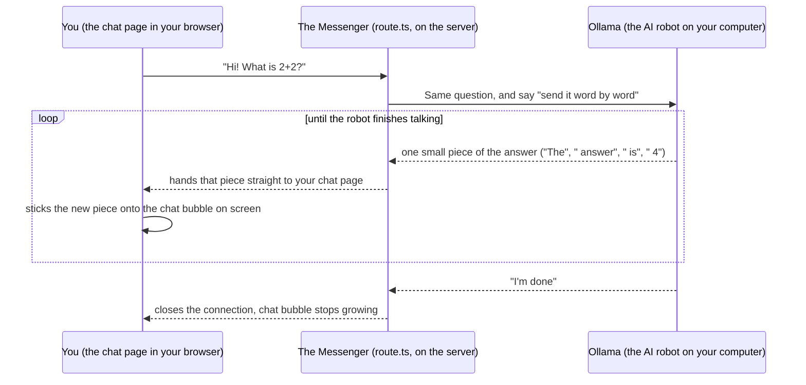

# Day 1: LLM API integration

**Week 1 — AI Foundations — Text & APIs** · Category: Frontend

## Status

- [x] Built (2026-08-06)

## Run it

```
npm install
cp .env.example .env.local   # check `ollama list` and edit OLLAMA_MODEL if needed
ollama serve                 # if it isn't already running as a background service
npm run dev
```

Open http://localhost:3000 and type something. The reply comes word by word.

---

## Explain it like I'm 10

Think of a smart robot friend living inside your own computer. This robot is called **Ollama**. It is free. It lives on your machine. You don't need internet or anyone's permission to talk to it.

You made a small chat page (like a text message app) where you type a question. But your chat page cannot talk to the robot directly. A web page is not allowed to talk to programs on your computer by itself — this is for safety. So you built a **messenger** in between. In this project, the messenger is a file called `route.ts`. Its job is simple:

1. Take your question from the chat page.
2. Go to the robot (Ollama) and ask your question.
3. The robot does not answer in one go. It thinks and talks **one word at a time**, like when you tell a story and think of the next word as you speak.
4. Every time the robot says one more word, the messenger runs back and gives that one word to your chat page.
5. Your chat page adds each word to the screen right away. So you see the answer growing bit by bit, instead of staring at a blank screen and then seeing the full answer pop up at the end.

This "words appearing one by one" trick is called **streaming**. It is the same reason a video call plays sound and video as it happens, instead of making you wait for the whole call to finish first.

## How it flows (diagram)



Read it from top to bottom: you ask one question. Then there is a loop where small pieces of the answer keep arriving, until the robot says "I'm done."

---

## If someone wakes you up at midnight and quizzes you

Practice these until you can answer without thinking.

**Q: What does this project do, in one line?**
A: It is a chat page that sends your message to a free AI model on my own computer (Ollama), and shows the reply coming word by word, not all at once.

**Q: What is Ollama?**
A: A program that runs AI language models on your own computer. It is free. No internet needed. No API key needed.

**Q: Why does the reply come word by word, not all at once?**
A: Because the AI model itself makes its answer one small piece at a time. It does not know the full sentence before it starts. We show each piece to the user as soon as it is ready, instead of making them wait for everything. This is called **streaming**.

**Q: What is a "route handler"?**
A: A file inside `app/api/...` in a Next.js project. It works like a small backend endpoint. Ours is `app/api/chat/route.ts`. When the browser sends a request to `/api/chat`, the code in this file runs on the server and decides what to do.

**Q: Why can't the browser talk to Ollama directly?**
A: It could, but it is cleaner and safer to go through our own server first. This way, if we ever change Ollama to a different AI provider, we only change one file — the route handler. The chat page does not need to know or care.

**Q: What is NDJSON?**
A: It means "newline-delimited JSON." Instead of Ollama sending one big reply at the end, it sends many small JSON messages, one on each line, as it goes. Each one looks like `{"message":{"content":"Hel"}, "done":false}`.

**Q: Why do you "buffer" partial lines?**
A: Data comes over the network in chunks of random size. A chunk can cut a line of text right in the middle. So we save the unfinished piece and add it to the front of the next chunk. This way we never try to read half a sentence as if it is complete.

**Q: What happens if Ollama is not running?**
A: The route handler tries to connect to Ollama and fails (`ECONNREFUSED`). We send back a clear error telling the user to run `ollama serve`, instead of letting the page hang with no explanation.

**Q: What happens if the model name is wrong?**
A: Ollama replies, but says no to the request because it does not have that model. We catch this and send back a `502` error, telling the user to run `ollama pull <model-name>`.

---

## What to build

Call a local Ollama model from a Next.js API route. Stream the response to the frontend using ReadableStream. Build a simple chat UI with Tailwind.

## Deep-dive topics

Learn and understand these before or while building — this is the "why" behind the feature, not just the "how":

- How Ollama serves models locally as a REST API (default: http://localhost:11434)
- Difference between Ollama's /api/generate and /api/chat endpoints
- Streaming NDJSON responses from Ollama and forwarding them with ReadableStream in a Next.js route handler
- Building a minimal chat UI with Tailwind that renders streamed tokens as they arrive

## Stack for this project

Next.js, TypeScript, Tailwind, Ollama

## Deep dive: how it actually works (technical)

Built with Next.js 14 (App Router). Two main pieces:

**`app/api/chat/route.ts` (the backend piece, explained from the start)**

This is a Next.js Route Handler. It is a file that exports a `POST` function and becomes an API endpoint at `/api/chat`. You don't need a separate backend server — Next.js runs this file on its own server.

What it does, step by step:

1. Reads `{ messages }` from the request body. This is the full conversation so far. Ollama, like most chat APIs, does not remember past requests on its own — you must send the whole conversation every single time.
2. Calls Ollama's `POST /api/chat` with `stream: true`. This is the key difference from a normal API call. Instead of waiting for the full answer and sending back one JSON object, Ollama starts writing its reply right away and keeps the connection open. It writes a new small JSON object, on its own line, every time it makes more text. This format — one JSON value per line — is called **NDJSON** (newline-delimited JSON). Most LLM servers use this to stream partial output, because one giant JSON object cannot be "half sent" and read in pieces — NDJSON can.
3. NDJSON is a low-level format specific to Ollama. So the route handler changes it before sending anything to the browser. It reads Ollama's stream with `getReader()`, turns each chunk of bytes into text, splits it on newlines to find full JSON lines, and pulls out only the `message.content` field from each one — the real text piece. One tricky part: network chunks do not line up neatly with NDJSON lines. A chunk can end in the middle of a line. So the code saves any half-finished line in a `buffer` variable and adds it to the front of the next chunk, instead of trying to read a broken line as JSON.
4. Each text piece goes into a **new** `ReadableStream`, which this route sends back as the response. So the browser only ever sees plain text, one small piece at a time. It never needs to know Ollama's NDJSON format exists. This matters a lot: if you swap Ollama for a different model server with a different streaming format, only this one file changes — not the frontend.

**`app/page.tsx` (the chat UI)**

Plain React state (`messages`, `input`, `isStreaming`). When you submit, it sends the conversation to `/api/chat`, then reads the reply with `getReader()` in a `while` loop. Each new piece of text gets added onto the last (assistant) message in state as it arrives. This is what makes the word-by-word effect on screen — no extra library needed.

**What tripped me up / worth knowing:**

- Ollama's `/api/chat` vs `/api/generate`: `/api/chat` takes a `messages` array (role + content). It is the right choice for a chat UI, since it matches the shape you need for a multi-turn conversation. `/api/generate` takes one plain prompt string — simpler, but you have to build the conversation formatting yourself.
- `runtime = 'nodejs'` is set on purpose in the route. Next.js route handlers can run on the Edge runtime or the Node.js runtime. Edge has some limits that can make long, server-to-server streaming harder, so Node.js is the safer default here.
- If Ollama is not running, or the model is not pulled, the call to Ollama fails. The route returns a `502` error telling you to check `ollama serve` and `ollama pull`, instead of just hanging silently.
- This actually happened: `ollama serve` was not running. It showed up as `TypeError: fetch failed` / `ECONNREFUSED` in the Next.js server logs — that means the route handler could not even reach `localhost:11434`. This is different from the `502` case above (that happens when Ollama *is* reachable but says no to the request, like an unknown model). Also, the default model name was set to `llama3.1`, but the models actually pulled were `llama3.2` and `nomic-embed-text`, not `llama3.1`. Fixed by setting `OLLAMA_MODEL` to `llama3.2` in `.env.local` (this is now the code default too), and starting `ollama serve`. Lesson: always check `ollama list` before you assume a model name.

---

## Using other AI models (just hints — not built here)

This project talks to Ollama, but all the "talk to the AI" logic stays inside one file (`route.ts`). This means changing to a completely different AI model or provider — not just a different Ollama model — is a small, contained change. The chat page (`page.tsx`) never needs to change, no matter which AI is behind it.

Here is the same feature, adapted to other models, from smallest change to biggest:

**1. A different model, still inside Ollama**

```
ollama pull mistral        # or phi3, gemma2, qwen2.5, etc.
```

Then in `.env.local`: `OLLAMA_MODEL=mistral`. Restart `npm run dev`. Nothing else changes — same NDJSON format, same code.

**2. A different local runner (not Ollama at all)**

Tools like **LM Studio** and **vLLM** also run models on your own machine. Both can offer an **OpenAI-compatible** endpoint (`/v1/chat/completions`). If you use one of those, follow the OpenAI-format parsing below instead of Ollama's NDJSON format. Everything still stays local and free — you are just running a different server program.

**3. OpenAI's API (hosted, paid)**

OpenAI streams using Server-Sent Events (SSE), not NDJSON. Each line looks like `data: {"choices":[{"delta":{"content":"Hel"}}]}` and ends with `data: [DONE]`. Three changes needed in `route.ts`:

1. Fetch URL: `https://api.openai.com/v1/chat/completions`
2. Add a header: `Authorization: Bearer ${process.env.OPENAI_API_KEY}`
3. Parsing loop: remove the `data: ` prefix, skip the `[DONE]` line, and read `.choices[0].delta.content` instead of `.message.content`

**4. Anthropic's Claude API (hosted, paid)**

Endpoint is `https://api.anthropic.com/v1/messages`, with headers `x-api-key` and `anthropic-version`. Its streaming events have types (`content_block_delta`, `message_stop`, and so on), not one single shape. So the parsing loop needs a `switch` on the event type. Everything else follows the same pattern.

**5. Google Gemini (hosted, has a free tier)**

Endpoint is `https://generativelanguage.googleapis.com/v1beta/models/gemini-1.5-flash:streamGenerateContent`, with the API key as a query parameter. It streams a JSON array bit by bit, not clean NDJSON/SSE lines, so parsing is a little more fiddly — but the overall idea (read the stream → pull out the text → send it to the browser) stays the same.

**6. Groq or Mistral's hosted APIs (hosted, fast and cheap)**

Both are OpenAI-compatible — same SSE format as OpenAI above, just a different web address and API key. If you already did the OpenAI hint, switching to either of these is a one-line change.

The pattern across all of these: **only the "call the model and read its stream" logic changes.** The outgoing `ReadableStream` to the browser, the buffering logic, and the whole frontend stay exactly the same. That separation is the real lesson of Day 1 — more than Ollama itself.
