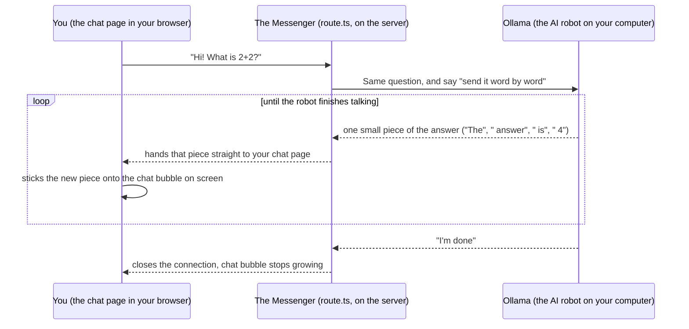

# Day 1: LLM API integration

**Week 1 — AI Foundations — Text & APIs** · Category: Frontend

## Status

- [x] Built (2026-08-06)

## Run it

```
npm install
cp .env.example .env.local   # check `ollama list` and edit OLLAMA_MODEL if needed
ollama serve                 # if it isn't already running as a background service
npm run dev
```

Open http://localhost:3000 and start typing. The reply streams in word by word.

---

## Explain it like I'm 10

Imagine you have a very smart robot friend living inside your own computer. This robot is called **Ollama**. It's free, it lives on your machine, and you don't need the internet or anyone's permission to talk to it.

You built a little chat page (like a text message app) where you type a question. But your typed question can't talk to the robot directly — a website page isn't allowed to talk to programs on your computer by itself, for safety reasons. So you built a **messenger** in between. In this project, the messenger is a file called `route.ts`. Its whole job is:

1. Take your question from the chat page.
2. Walk over to the robot (Ollama) and ask it your question.
3. The robot doesn't answer all at once. It thinks and talks **one word at a time**, like when you're telling a story and figuring out the next word as you go.
4. Every time the robot says one more word, the messenger runs back and hands that single word to your chat page.
5. Your chat page glues each word onto the screen right away, so you see the answer appearing bit by bit — instead of staring at a blank screen and then suddenly seeing the whole answer pop up.

That "seeing the words appear one by one" trick is called **streaming**. It's the same reason a video call has sound and video as it happens, instead of you waiting for the whole call to finish before hearing anything.

## How it flows (diagram)



Read it top to bottom: you ask once, then there's a loop where little pieces of the answer keep arriving until the robot says "I'm done."

---

## If someone wakes you up at midnight and quizzes you

Rehearse these until you can say them without thinking.

**Q: What does this project do, in one sentence?**
A: It's a chat page that sends your message to a free AI model running on my own computer (Ollama), and shows the reply appearing word by word instead of all at once.

**Q: What is Ollama?**
A: A program that runs AI language models directly on your own computer, for free, with no internet needed and no API key.

**Q: Why does the reply show up word by word instead of all at once?**
A: Because the AI model itself generates its answer one small piece at a time — it doesn't know the whole sentence before it starts. We show each piece to the user the moment it's ready instead of making them wait for the whole thing. This is called **streaming**.

**Q: What is a "route handler"?**
A: A file in `app/api/...` in a Next.js project that acts like a mini backend endpoint. Ours is `app/api/chat/route.ts` — when the browser sends a request to `/api/chat`, this file's code runs on the server and decides what to do with it.

**Q: Why can't the browser talk to Ollama directly?**
A: It could, technically — but it's cleaner and safer to go through our own server first. That way, if we ever swap Ollama for a different AI provider, we only change one file (the route handler), and the chat page doesn't need to know or care.

**Q: What is NDJSON?**
A: "Newline-delimited JSON." Instead of Ollama sending one giant reply at the end, it sends many small JSON messages, one per line, as it goes. Each one looks like `{"message":{"content":"Hel"}, "done":false}`.

**Q: Why do you "buffer" partial lines?**
A: Data arrives over the network in random-sized chunks — a chunk might cut a line of text right in the middle. So we hold onto the leftover unfinished piece and glue it to the front of the next chunk, instead of trying to read half a sentence as if it were whole.

**Q: What happens if Ollama isn't running?**
A: The route handler's request to Ollama fails to even connect (`ECONNREFUSED`), and we return a clear error telling the user to run `ollama serve` — instead of the page just hanging forever with no explanation.

**Q: What happens if the model name is wrong?**
A: Ollama responds, but rejects the request because it doesn't have that model. We catch that and return a `502` error explaining to run `ollama pull <model-name>`.

---

## What to build

Call a local Ollama model from a Next.js API route. Stream the response to the frontend using ReadableStream. Build a simple chat UI with Tailwind.

## Deep-dive topics

Research and understand these before or while building — this is the "why" behind the feature, not just the "how":

- How Ollama serves models locally as a REST API (default: http://localhost:11434)
- Difference between Ollama's /api/generate and /api/chat endpoints
- Streaming NDJSON responses from Ollama and forwarding them with ReadableStream in a Next.js route handler
- Building a minimal chat UI with Tailwind that renders streamed tokens as they arrive

## Stack for this project

Next.js, TypeScript, Tailwind, Ollama

## Deep dive: how it actually works (technical)

Built a Next.js 14 App Router project with two pieces:

**`app/api/chat/route.ts` (the backend piece, explained from the ground up)**

This is a Next.js Route Handler — a file that exports a `POST` function and becomes an API endpoint at `/api/chat`. No separate backend server needed; Next.js runs this on its own server.

What it does, step by step:

1. Reads `{ messages }` from the request body — the full conversation so far (Ollama, like most chat APIs, is stateless: you resend the whole conversation every time, it doesn't remember past requests on its own).
2. Calls Ollama's `POST /api/chat` with `stream: true`. This is the key difference from a normal REST call. Instead of waiting for the full answer and sending back one JSON object, Ollama starts writing the HTTP response immediately and keeps the connection open, writing a new small JSON object on its own line every time it generates more text. This format — one JSON value per line — is called **NDJSON** (newline-delimited JSON). It's the standard way LLM servers stream partial output, because a single giant JSON object can't be "half-sent" and parsed incrementally; NDJSON can.
3. Because NDJSON is a low-level, Ollama-specific format, the route handler translates it before sending anything to the browser. It reads Ollama's stream with `getReader()`, decodes each chunk of bytes to text, splits on newlines to find complete JSON lines, and pulls out just the `message.content` field from each one — the actual text token. A subtlety here: network chunks don't line up with NDJSON line boundaries, so a chunk might end mid-line. The code holds any incomplete trailing line in a `buffer` variable and prepends it to the next chunk, rather than trying to `JSON.parse` a half-finished line.
4. Each extracted token is written into a **new** `ReadableStream` that this route returns as the response body. The browser therefore receives plain text, one small piece at a time — it never has to know Ollama's NDJSON format exists. This separation matters: if you ever swap Ollama for a different model server with a different streaming format, only this one file changes, not the frontend.

**`app/page.tsx` (the chat UI)**

Standard React state (`messages`, `input`, `isStreaming`). On submit, it POSTs the conversation to `/api/chat`, then reads the response body with `getReader()` in a `while` loop, appending each decoded chunk onto the last (assistant) message in state as it arrives — that's what produces the token-by-token streaming effect in the UI, with no extra libraries.

**What tripped me up / worth knowing:**

- Ollama's `/api/chat` vs `/api/generate`: `/api/chat` takes a `messages` array (role + content) and is the right one for a conversational UI, since it matches the shape you'll want for multi-turn chat. `/api/generate` takes a single raw prompt string — simpler, but you'd have to build the conversation formatting yourself.
- `runtime = 'nodejs'` is set explicitly on the route. Next.js route handlers can run on either the Edge runtime or Node.js; Edge has restrictions that can complicate long-lived server-to-server streaming, so Node.js is the safer default here.
- If Ollama isn't running, or the model hasn't been pulled, the fetch to Ollama fails — the route returns a `502` with a message telling you to check `ollama serve` and `ollama pull`, instead of a silent hang.
- Hit this for real: `ollama serve` wasn't running, which surfaced as `TypeError: fetch failed` / `ECONNREFUSED` in the Next.js server logs — that's the route handler failing to even reach `localhost:11434`, distinct from the 502 case above (which fires when Ollama *is* reachable but rejects the request, e.g. unknown model). Also had `llama3.1` set as the default — actually had `llama3.2` and `nomic-embed-text` pulled instead, not `llama3.1`. Fixed by pointing `OLLAMA_MODEL` at `llama3.2` in `.env.local` (now also the code default) and starting `ollama serve`. Lesson: always check `ollama list` before assuming a model name.

---

## Using other AI models (just hints — not built here)

This project talks to Ollama, but the design keeps all "talk to the AI" logic inside one file (`route.ts`). That means swapping in a completely different AI model or provider — not just a different Ollama model — is a small, contained change. The chat page (`page.tsx`) never needs to change at all, no matter which AI is behind it.

Here's the same feature adapted to several other models, from smallest change to biggest:

**1. A different model, still inside Ollama**

```
ollama pull mistral        # or phi3, gemma2, qwen2.5, etc.
```

Then in `.env.local`: `OLLAMA_MODEL=mistral`. Restart `npm run dev`. Nothing else changes — same NDJSON format, same code.

**2. A different local runner (not Ollama at all)**

Tools like **LM Studio** and **vLLM** also run models on your own machine and both can expose an **OpenAI-compatible** endpoint (`/v1/chat/completions`). If you point at one of those, use the OpenAI-format parsing described below instead of Ollama's NDJSON format — everything stays local and free, you're just running a different server.

**3. OpenAI's API (hosted, paid)**

OpenAI streams using Server-Sent Events (SSE), not NDJSON — each line looks like `data: {"choices":[{"delta":{"content":"Hel"}}]}` and ends with `data: [DONE]`. Three changes in `route.ts`:

1. Fetch URL: `https://api.openai.com/v1/chat/completions`
2. Add a header: `Authorization: Bearer ${process.env.OPENAI_API_KEY}`
3. Parsing loop: strip the `data: ` prefix, skip the `[DONE]` line, read `.choices[0].delta.content` instead of `.message.content`

**4. Anthropic's Claude API (hosted, paid)**

Endpoint `https://api.anthropic.com/v1/messages`, headers `x-api-key` and `anthropic-version`. Streaming events are typed (`content_block_delta`, `message_stop`, etc.) rather than one uniform shape, so the parsing loop needs a `switch` on event type — same overall pattern otherwise.

**5. Google Gemini (hosted, has a free tier)**

Endpoint `https://generativelanguage.googleapis.com/v1beta/models/gemini-1.5-flash:streamGenerateContent`, API key as a query param. Streams a JSON array incrementally rather than clean NDJSON/SSE lines, so parsing is a little fiddlier — but the shape of the solution (read stream → pull out text → re-stream to browser) is unchanged.

**6. Groq or Mistral's hosted APIs (hosted, fast/cheap)**

Both are OpenAI-compatible — same SSE format as OpenAI above, just a different base URL and API key. If you've already done the OpenAI hint, swapping to either of these is a one-line URL change.

The pattern across all of these: **only the "call the model and parse its stream" logic changes.** The outgoing `ReadableStream` to the browser, the buffering approach, and the entire frontend stay identical — that separation is the actual lesson of Day 1, more than Ollama specifically.
