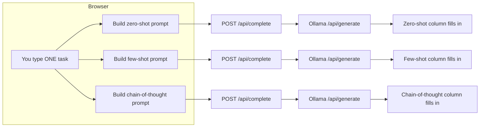

# Day 2: Prompt engineering basics

**Week 1 — AI Foundations — Text & APIs** · Category: Frontend

## Status

- [x] Built (2026-08-06)

## Run it

```
npm install
cp .env.example .env.local   # check `ollama list` and edit OLLAMA_MODEL if needed
ollama serve                 # if it isn't already running as a background service
npm run dev
```

Open http://localhost:3000, click "Run all three", and watch the same task get answered three different ways at the same time.

---

## Explain it like I'm 10

Think about asking a friend a tricky question in three different ways, just to see which way gets the best answer.

**Way 1 — Zero-shot:** You ask the question straight, with no help. "Is this review good or bad?"

**Way 2 — Few-shot:** Before you ask, you first show your friend 3 solved examples, like flash cards: "Here is a good review, here is a bad one, here is a so-so one — now, what about this one?" Seeing examples first helps your friend copy the pattern and answer in the exact shape you want.

**Way 3 — Chain-of-thought:** You tell your friend, "Don't just blurt out an answer — think out loud first, then tell me your final answer." This makes your friend slow down and really weigh the good and bad points, instead of guessing fast and maybe getting it wrong.

This project asks your local AI robot (Ollama) the exact same question in all three ways, at the same time, and shows all three answers side by side. So you can actually watch the difference good instructions make.

There are also two dials: **temperature** and **top_p**. Turn temperature up, and the robot becomes more willing to try surprising words instead of always playing safe. Turn it down, and it becomes very predictable, repeating the safest answer every time. `top_p` is a second, similar dial for how much the robot is allowed to "explore" instead of always picking its top guess.

## How it flows (diagram)



All three requests go out at the same time (`Promise.all`). So all three columns stream in together, not one after the other.

---

## If someone wakes you up at midnight and quizzes you

**Q: What is prompt engineering, in one line?**
A: Choosing the wording, structure, and examples you give an AI model with care, so you get the answer you actually want — without changing the model itself.

**Q: What is the difference between zero-shot and few-shot prompting?**
A: Zero-shot gives the model only an instruction, no examples. Few-shot shows the model a few worked examples of the task done correctly, before asking the real question. The model then follows that same pattern.

**Q: What is chain-of-thought prompting, and why does it help?**
A: It means asking the model to reason step by step before giving a final answer, instead of answering right away. It helps because the model "thinks out loud" first. This tends to catch small details and improve accuracy on anything that needs weighing more than one point — but the answer takes longer to come.

**Q: What does temperature control?**
A: How willing the model is to pick a less-likely next word, instead of always the most-likely one. Low temperature means safe and steady answers. High temperature means more varied answers — sometimes more creative, sometimes less clear.

**Q: What does top_p do, and how is it different from temperature?**
A: top_p limits the model to only look at the smallest group of next-word choices that together add up to top_p of the total chance (for example, 0.9 means "the top 90% most likely words"). It is a different dial on the same idea — how much randomness the model is allowed. The two are often adjusted together.

**Q: Why does this project call /api/generate instead of /api/chat like Day 1 did?**
A: /api/chat is built for back-and-forth conversation — it takes a list of messages and expects history. /api/generate takes one plain prompt string and knows nothing about conversation. Since every prompt-mode comparison here is one single, separate request with no history, /api/generate is the right fit.

**Q: Why run all three prompt modes at the same time, instead of one after another?**
A: So you can watch and compare them live as they stream in. Also, the total wait time becomes roughly "as long as the slowest one" instead of adding up all three wait times.

**Q: Why do smaller local models need more clear and detailed prompting than big hosted models like GPT-4o or Claude Opus?**
A: Big hosted models have far more parameters and heavier training on following instructions. So they are better at guessing what you meant, even from a vague instruction. Smaller local models (like the 3B/8B models most people run at home) are not as good at "reading between the lines." Few-shot examples and clear formatting instructions do more of the work that a bigger model would have figured out on its own.

---

## What to build

Learn zero-shot, few-shot, and chain-of-thought prompting against a local Ollama model. Build a prompt playground UI where you can switch modes and compare outputs side by side.

## Deep-dive topics

- Zero-shot vs few-shot vs chain-of-thought prompting, with examples
- How temperature and top_p change output on the same local model
- Why smaller local models (7B/8B) need more explicit prompting than hosted frontier models
- Designing a side-by-side comparison UI

## Stack for this project

Next.js, React, Tailwind, Ollama

## Deep dive: how it actually works (technical)

**`lib/prompts.ts` — the actual prompt engineering**

This is the most important file to understand. `buildPrompt(mode, task)` takes one task string and wraps it in three different ways:

- `zero-shot` — the task plus one short instruction, nothing else
- `few-shot` — three worked review-to-sentiment examples, then the real task in the same shape, so the model just continues the pattern
- `chain-of-thought` — the task plus an instruction to reason first and end with one exact line format

These templates are kept in a separate file, not written inline in the UI or the API route. This makes them easy to read, change, and compare on their own — which is the whole point of a "prompt playground."

**`app/api/complete/route.ts` — same streaming idea as Day 1, different endpoint**

Uses Ollama's `/api/generate` instead of `/api/chat`. The response's NDJSON shape is also different: each line has a `response` field, not `message.content`. The buffering and parsing logic is otherwise the same as Day 1 — read the stream, split on newlines, hold back any half-finished line, pull out the text, send plain text to the browser. `temperature` and `top_p` are sent inside an `options` object in the request body, exactly how Ollama's API expects them.

**`app/page.tsx` — running three streams at the same time**

The key part is `runAll()`, which calls `Promise.all(MODES.map(m => runOne(m.id)))`. Each `runOne` runs its own `fetch` + `getReader()` loop and updates only its own key in the `outputs` state object. This lets all three columns stream at the same time without getting mixed up. The "show exact prompt sent" checkbox calls `buildPrompt` directly in the UI just to display it — the same function the API route uses with the same inputs, so what you see really is what gets sent.

**What tripped me up / worth knowing:**

- It is tempting to reuse Day 1's `/api/chat` route here, but `/api/generate` is the more honest choice — these are separate, one-time completions being compared, not a back-and-forth chat.
- The few-shot examples are written for sentiment classification only. If you change the "Task" text to something outside that pattern (like a math question), the few-shot prompt's examples will not match the new task's shape. That is expected, and worth trying — it shows that few-shot prompting only helps when the examples match the kind of task you are asking.
- Running three streams at the same time from client-side `fetch` calls is simple in the browser, no special library needed — each `Response.body.getReader()` works on its own.

---

## Using other AI models (just hints — not built here)

Prompt engineering itself — zero-shot, few-shot, chain-of-thought, temperature, top_p — is not something special to Ollama. This is how you work with almost any LLM. What changes between providers is just the shape of the API call, same as Day 1.

**1. A different local Ollama model**

Change `OLLAMA_MODEL` in `.env.local`. Same `/api/generate` shape, same code, just a different model "brain" answering.

**2. A different local runner (LM Studio, vLLM, llama.cpp)**

These usually offer an OpenAI-compatible `/v1/completions` or `/v1/chat/completions` endpoint instead of Ollama's `/api/generate`. Change the fetch URL and adjust the request body shape (see hint 3) — the three prompt templates in `lib/prompts.ts` do not need to change at all, since they are just plain text.

**3. OpenAI's API**

Use `/v1/completions` (older, single-prompt style, closest match to what this project does) or `/v1/chat/completions` with one user message. `temperature` and `top_p` are supported with the exact same names and meaning — this is not a coincidence, most providers copied OpenAI's parameter names. Streaming uses SSE (`data: {...}` lines), not NDJSON.

**4. Anthropic's Claude API**

Claude's API is chat-shaped (`messages`), so a one-time prompt becomes a single user message. Claude also uses `temperature` and `top_p`, with the same meaning. Streaming events have types (`content_block_delta`, and so on), not one single shape.

**5. Google Gemini / Groq / Mistral**

Gemini has its own request and response shape (see Day 1's hint for the endpoint). Groq and Mistral's hosted APIs are OpenAI-compatible, so the same `temperature`/`top_p` parameters and SSE streaming format from the OpenAI hint apply directly — just a different web address and API key.

The one thing true across all of them: **the prompting skills you are learning here (zero-shot, few-shot, chain-of-thought) carry over directly.** Only the transport (endpoint, login, streaming format) changes.
