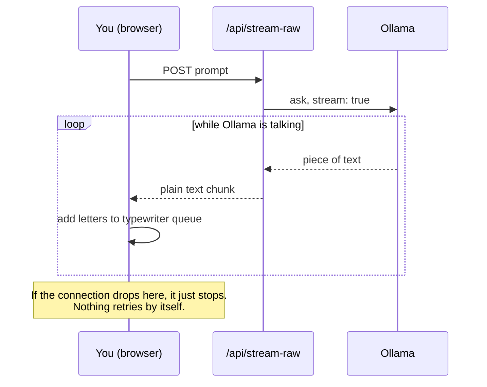
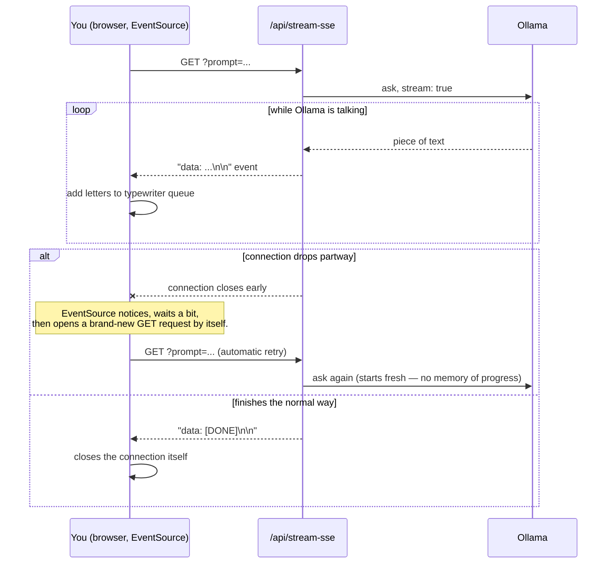

# Day 3: Streaming text responses

**Week 1 — AI Foundations — Text & APIs** · Category: Frontend

## Status

- [x] Built (2026-08-06)

## Run it

```
npm install
cp .env.example .env.local   # check `ollama list` and edit OLLAMA_MODEL if needed
ollama serve                 # if it isn't already running as a background service
npm run dev
```

Open http://localhost:3000. Both panels answer the same prompt. Try the "simulate a dropped connection" checkbox to see the real difference between the two methods.

---

## Explain it like I'm 10

Days 1 and 2 already showed text streaming in bit by bit. Day 3 asks a deeper question: **what happens when the connection breaks halfway through?**

There are two ways to get live text from a server to a browser:

**Way 1 — Fetch + ReadableStream (what Days 1 and 2 used):** Like a phone call with no auto-redial. If the call drops, it just drops. Nobody calls you back on their own. You have to notice it stopped and dial again yourself.

**Way 2 — Server-Sent Events, called "SSE" (new in this project):** Like a phone call where, if it drops, your phone automatically redials the same number for you after a few seconds. You don't have to do anything. The browser has a built-in tool for this called `EventSource`, and it does the redialing on its own.

But here's the catch: when the "redial" happens, the AI has no memory of what it already said. So the answer starts over from the beginning, not from where it stopped. Auto-reconnect does not mean "auto-resume."

This project also adds a **typewriter effect** — instead of dumping a whole burst of text on screen the instant it arrives, it reveals the text at a steady, calm pace, like someone typing it out in front of you. That way, the text on screen always looks smooth, even if the network delivers it in uneven bursts.

## How it flows (diagrams)

**Fetch + ReadableStream — no auto reconnect**



**Server-Sent Events (SSE) — auto reconnect, but starts over**



---

## If someone wakes you up at midnight and quizzes you

**Q: What is SSE, in one line?**
A: Server-Sent Events — a standard way for a server to keep pushing small text updates to the browser over one open connection, using the browser's built-in `EventSource` tool.

**Q: What is the real difference between plain fetch + ReadableStream, and true SSE?**
A: Both send text bit by bit. But SSE has a fixed wire format (`data: ...` lines) and the browser's `EventSource` handles it with automatic reconnect built in. Plain fetch streaming has no fixed format and no automatic reconnect — you write and control everything yourself.

**Q: Why does EventSource only support GET requests, and how did that affect this project?**
A: It's a browser limit — `EventSource` was built only for GET, with no option to send a body or custom headers. So instead of sending the prompt in a POST body (like Day 1 and Day 2), the SSE route reads it from the URL's query string instead.

**Q: What happens automatically when an SSE connection drops? What does NOT happen automatically?**
A: The browser automatically opens a new connection after a short wait (set by the `retry:` field). What does NOT happen automatically: picking up where the old connection left off. There's no built-in memory of progress — the new request starts the whole process over.

**Q: Why does dropping and reconnecting the SSE demo restart the answer instead of continuing it?**
A: Because our server has no idea what it already sent last time. Real production systems that need true "resume, not restart" behavour use extra tools, like the `Last-Event-ID` header, and a server that remembers what it already sent for that ID. This project keeps it simple and does not build that part.

**Q: What is chunked transfer encoding?**
A: A way for an HTTP server to send a reply in pieces, without knowing the total size in advance, instead of sending one reply all at once with a fixed length. Streaming (both methods in this project) depends on this — that's what lets the connection stay open and keep sending small pieces over time.

**Q: What is a "typewriter effect", and why isn't it just "however fast the network sends text"?**
A: A typewriter effect shows text appearing at a steady, controlled speed, letter by letter. The raw network speed is jumpy — sometimes a big burst of words arrives at once, sometimes nothing for a moment. If you displayed text exactly as fast as the network gave it to you, it would look jumpy on screen. The typewriter hook takes whatever arrives and re-releases it at a steady pace instead.

**Q: Why does the typewriter hook use requestAnimationFrame and a ref, instead of calling setState for every letter?**
A: Calling setState for every single letter would cause a React re-render for every single letter — wasteful, and it also fights with how fast the network happens to deliver chunks instead of a speed you actually chose. Using a ref to store "letters received but not shown yet," and one `requestAnimationFrame` loop to reveal a few letters and update state once per frame, means at most ~60 state updates per second, no matter how choppy or fast the network is.

**Q: What is React state batching, and why does it matter here?**
A: React can group up several state updates that happen close together into a single re-render, instead of re-rendering after each one. It matters here because it's the reason we deliberately update `displayed` state only once per animation frame — not once per character and not once per network chunk — keeping re-renders smooth and predictable.

---

## What to build

Implement SSE (Server-Sent Events) or ReadableStream in Next.js. Show a typewriter effect on the frontend. Useful for any AI chat interface.

## Deep-dive topics

- SSE vs fetch-based ReadableStream streaming — when to use which
- Chunked transfer encoding and how the browser buffers it
- Building a typewriter effect in React with state batching in mind
- Handling stream errors and reconnects

## Stack for this project

Next.js, React, TypeScript, Ollama

## Deep dive: how it actually works (technical)

**`app/api/stream-raw/route.ts` — plain fetch streaming, same idea as Day 1/2**

POST endpoint, reads Ollama's `/api/generate` NDJSON stream, forwards plain text chunks — the same pattern as earlier days. New in this file: a `simulateDrop` option. If it's on, once more than 60 characters have been sent, the route calls `controller.error(...)` to kill the stream on purpose, mimicking a real network failure. There's no way for the reader on the other side to recover from this automatically — that's the whole point of the demo.

**`app/api/stream-sse/route.ts` — real Server-Sent Events**

GET endpoint (required, since `EventSource` only sends GET). Same Ollama call underneath, but the output is formatted as real SSE:

- Every message is sent as `data: <json>\n\n` — note the **blank line** at the end. That blank line is what tells `EventSource` "this event is complete, fire `onmessage` now." Miss it, and events never fire.
- The very first thing sent is `retry: 2000\n\n`, which tells the browser "if you lose this connection, wait 2 seconds and reconnect on your own." This one line is what powers the automatic reconnect — no reconnect code was written on the frontend.
- A normal finish sends `data: [DONE]\n\n` so the frontend knows to stop and close cleanly.
- With `simulateDrop` on, the route just calls `controller.close()` early without sending `[DONE]` — an abrupt, unannounced end, exactly like a real dropped connection. `EventSource` on the browser side notices this and reconnects by itself.

**`lib/useTypewriter.ts` — the reveal effect, decoupled from network speed**

Two refs hold state that doesn't need to trigger a re-render: `queueRef` (text received but not shown yet) and `shownRef` (text already on screen). A `requestAnimationFrame` loop runs continuously, and on every frame it works out how many characters "should" have been shown by now based on elapsed time and the chosen `charsPerSecond` speed, moves that many characters from the queue to shown, and calls `setState` exactly once per frame — never once per character, never once per network chunk. `push(chunk)` just appends to the queue; it doesn't touch state or trigger any render by itself.

**`app/page.tsx` — two independent panels, one shared prompt**

`FetchStreamPanel` and `SsePanel` each own their own `useTypewriter` instance and their own status. The SSE panel additionally tracks a `reconnects` counter, driven entirely by `EventSource`'s `onerror` handler and its `readyState` (`CONNECTING` means it's about to retry automatically; `CLOSED` means it gave up for good, e.g. after a genuine error like a bad request).

**What tripped me up / worth knowing:**

- Forgetting the blank line after `data: ...` in the SSE route breaks `EventSource` silently — it just never fires `onmessage`, with no obvious error to look at. The blank line is not optional formatting, it's part of the protocol.
- `EventSource`'s `onerror` fires on every connection drop, including ones it's about to recover from automatically. Reading `readyState` is the only way to tell "about to retry" apart from "gave up for good."
- The `simulateDrop` timing (60 characters) is arbitrary, picked just to make the drop happen partway through the answer instead of instantly or after it's already done, so both panels have something visible on screen when it happens.

---

## Using other AI models (just hints — not built here)

This project's SSE panel is actually closer to how most hosted AI APIs stream in real life than Day 1 and Day 2's raw NDJSON approach was.

**OpenAI, Anthropic Claude, Groq, Mistral** — all of these stream using the same real SSE wire format built here (`data: {...}\n\n` lines). If you swap Ollama for any of them, the SSE route in this project barely changes shape — you'd change the fetch URL, add an auth header, and adjust how you pull the token out of each provider's JSON payload (see Day 1 and Day 2's hints for the exact per-provider shapes). The `retry:`, blank-line, and `[DONE]` ideas carry over directly.

**Google Gemini** — also streams, but not in the standard SSE line format; it streams a JSON array bit by bit instead. You'd still expose your own route as real SSE to the browser (so `EventSource` and the typewriter hook keep working unchanged) — you'd just need different parsing logic inside the route to pull text out of Gemini's stream shape before re-wrapping it as `data: ...\n\n`.

**A different local Ollama model** — no change needed at all beyond `OLLAMA_MODEL` in `.env.local`, same as every earlier day.

The one thing worth remembering: **the SSE format and the auto-reconnect behavior in this project are the browser's, not Ollama's.** Any backend that can format its output as `data: ...\n\n` gets that same auto-reconnect behavior for free, no matter which AI model is actually generating the text.
