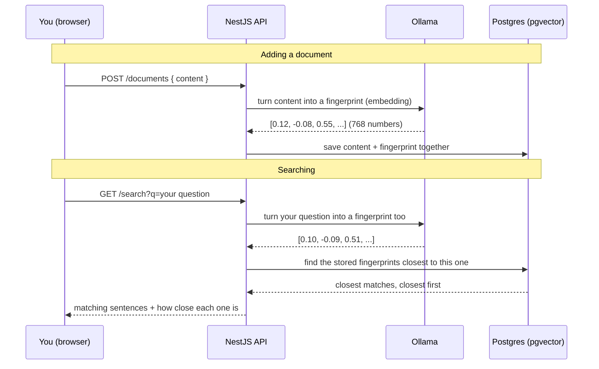

# Day 4: AI-powered search

**Week 1 — AI Foundations — Text & APIs** · Category: Full Stack

## Status

- [x] Built (2026-08-06)

## Run it

```
docker compose up -d          # starts Postgres with the pgvector extension available
cp .env.example .env
npm install
npx prisma generate           # needs internet, downloads Prisma's local database engine
npm run db:enable-vector      # turns on the pgvector extension for this database
npx prisma db push            # creates the "documents" table, including the vector column
ollama pull nomic-embed-text  # only needed once
ollama serve                  # if it isn't already running as a background service
npm run start:dev
```

Open http://localhost:3001, click "Seed sample documents", then search for something like "how do I get my money back" — notice it finds the refund document even though the word "money" is nowhere in it.

---

## Explain it like I'm 10

Think about a librarian who has read every book in the library and remembers what each one is *about*, not just the words in the title.

If you ask "do you have a book about a kid who goes to a magic school," the librarian doesn't need you to say "Harry Potter." They understand what you mean, and point you to the right shelf — even though your words don't match the book's title at all.

That's what this project does with sentences instead of books.

1. Every sentence we store gets turned into a list of numbers by Ollama. This list of numbers is called an **embedding**. Think of it like a fingerprint for *meaning* — sentences with similar meaning get similar-looking fingerprints, even if they don't share any of the same words.
2. We save each sentence AND its fingerprint together in a database.
3. When you search, your search text ALSO gets turned into a fingerprint the same way.
4. The database compares your fingerprint to every stored fingerprint, and finds the ones that look most alike.
5. Those closest matches are your search results — found by meaning, not by matching exact words.

This is why searching "how do I get my money back" can find a sentence about refunds, even though the word "money" never appears in it. The two sentences *mean* similar things, so their fingerprints are close together.

## How it flows (diagram)



---

## If someone wakes you up at midnight and quizzes you

**Q: What is an embedding, in one line?**
A: A list of numbers that represents the meaning of a piece of text. Text with similar meaning gets a similar list of numbers.

**Q: Why does similar meaning give a similar list of numbers?**
A: The embedding model was trained on huge amounts of text, and learned to place similar ideas near each other in this "number space." It's not a rule someone wrote by hand — the model learned it from examples.

**Q: What is cosine similarity, and how is it different from Euclidean distance?**
A: Cosine similarity looks at the *angle* between two number-lists (vectors), ignoring their size — it answers "do these two point in the same direction?" Euclidean distance looks at the actual straight-line gap between two points, which cares about size too. For text embeddings, direction usually matters more than size, so cosine similarity (or the closely related cosine distance) is the more common choice — that's what this project uses.

**Q: What is pgvector?**
A: A free add-on (extension) for PostgreSQL that adds a new column type called `vector`, plus fast ways to search "which stored vectors are closest to this one." Without it, Postgres has no built-in idea of what a vector search even means.

**Q: Why does the Prisma schema use `Unsupported("vector(768)")` instead of a normal type?**
A: Because Prisma doesn't have a built-in vector type. `Unsupported(...)` tells Prisma "create the column with exactly this raw SQL type, but don't try to build type-safe read/write helpers for it." That's why every query touching the `embedding` column in this project is written as raw SQL with `$queryRaw`, not the usual `prisma.document.findMany()` style.

**Q: What are ivfflat and hnsw?**
A: Two different kinds of index pgvector can build to make similarity search fast on large datasets. `ivfflat` groups vectors into rough clusters and only searches the closest clusters — fast to build, slightly less accurate. `hnsw` builds a layered graph of connections between vectors — usually more accurate and faster to search, but slower and more memory-heavy to build. This project skips both, since a handful of demo rows don't need an index at all — a full scan over 8 rows is already instant. You'd add one once you have thousands or millions of rows.

**Q: Why do you need the SAME embedding model for both storing and searching?**
A: Each embedding model has its own private "number space" — it decides on its own what each number means. Comparing a vector from one model to a vector from a different model is like comparing a fingerprint to a shoe print — they're not the same kind of measurement, so the comparison means nothing.

**Q: What is a NestJS module, controller, and service, in one line each?**
A: A **controller** handles incoming HTTP requests and decides which function should answer them. A **service** holds the actual logic (talking to the database, calling Ollama). A **module** is a box that groups a feature's controllers and services together and says how they connect to the rest of the app.

**Q: Why does `/api/embeddings` not need streaming, unlike the chat/generate endpoints from earlier days?**
A: An embedding is a single, complete, fixed-size answer — a list of 768 numbers, done in one shot. There's no "typing it out word by word" concept for a list of numbers, so Ollama just returns the whole thing as one normal JSON response.

---

## What to build

Build semantic search using embeddings from a local Ollama embedding model (e.g. nomic-embed-text). Store vectors in PostgreSQL with pgvector. Query by similarity. This is the foundation of most AI search products.

## Deep-dive topics

- What an embedding actually is (a vector that encodes meaning) and why similar meaning = similar vector
- Cosine similarity vs Euclidean distance for vector search
- Setting up the pgvector extension in PostgreSQL and defining a vector column
- ivfflat vs hnsw indexes — trade-offs for small vs large datasets
- Running vector queries through Prisma (raw SQL, since Prisma has no native vector type yet)

## Stack for this project

NestJS, PostgreSQL, Prisma, pgvector, Ollama

## Deep dive: how it actually works (technical)

This is the first NestJS project in the roadmap, and the first one with a real database — so a bit more setup than earlier days, in exchange for a much more realistic backend shape.

**Project layout**

- `src/ollama/ollama.service.ts` — the only place that talks to Ollama's `/api/embeddings` endpoint. Plain, non-streaming JSON in, JSON out.
- `src/pgvector.ts` — one small helper, `toVectorLiteral()`, that turns a JS number array into the text format pgvector expects (`[0.1,0.2,0.3]`), so it can be passed as a query parameter and cast to `vector` on the Postgres side.
- `src/documents/*` — `POST /documents` (add one sentence) and `POST /documents/seed` (add the built-in sample sentences). Both go through `DocumentsService.create()`, which embeds the text, then inserts content + embedding together with one raw SQL `INSERT ... RETURNING`.
- `src/search/*` — `GET /search?q=...` embeds the query text, then runs a raw SQL `SELECT ... ORDER BY embedding <=> $vector LIMIT $n` to get the closest matches straight from the database, already sorted.
- `src/app.controller.ts` + `src/home.html.ts` — a single inline HTML page (no separate frontend project) with a search box, a "seed sample documents" button, and a form to add your own sentences. It's plain `fetch()` calls to the same API — nothing framework-specific.
- `prisma/schema.prisma` — defines the `documents` table shape, including the `Unsupported("vector(768)")` embedding column explained above.
- `scripts/enable-pgvector.ts` — a one-time script that runs `CREATE EXTENSION IF NOT EXISTS vector;`. This has to happen before `prisma db push` creates the table, and Prisma itself has no concept of "extensions," so it can never do this step automatically.

**Why raw SQL for the vector parts, and why that's actually fine**

Normally in a NestJS + Prisma project you'd write `prisma.document.findMany({ where: ... })` and get full type safety. That's not possible here for anything touching `embedding`, because it's an `Unsupported()` field. Instead, `$queryRaw` (a tagged template function on `PrismaService`, which every `PrismaClient` has regardless of your schema) is used directly. Values interpolated into a `$queryRaw` template are still safely parameter-bound by Prisma — it's not raw string concatenation, so there's no SQL injection risk from doing it this way.

**The actual similarity query, piece by piece**

```sql
SELECT id, content, (embedding <=> $1::vector) AS distance
FROM documents
ORDER BY embedding <=> $1::vector
LIMIT $2
```

- `<=>` is pgvector's cosine distance operator. Smaller number = more similar.
- We sort by that distance directly in the database — Postgres does the comparison work across every row and hands back only the closest ones already in order. We never pull every row into Node.js and sort them ourselves, which would not scale.
- The API then converts distance to similarity (`1 - distance`) before sending it back, since "0.92 similarity" reads more naturally to a person than "0.08 distance."

**What tripped me up / worth knowing:**

- `prisma generate` needs internet access to download Prisma's local query engine binary the first time. This is normal for any fresh Prisma project — the sandbox this project was written in couldn't reach the download server, but a real developer machine can.
- `db push` was used here instead of `migrate dev`, on purpose — it's simpler for a fast local demo, since it skips the shadow-database step migrations normally use. For a real production project, `migrate dev` (which keeps a proper history of schema changes) is the better choice.
- Forgetting to run the `db:enable-vector` script before `db push` causes `db push` to fail, since Postgres doesn't know what the `vector` type even is until the extension is turned on.
- Port 3001 was picked on purpose, so this can run at the same time as the Next.js projects from earlier days (which default to port 3000) without a clash.
- **`prisma` (the CLI) and `@prisma/client` must stay on the same major version.** `package.json` had `prisma: ^7.9.1` alongside `@prisma/client: ^5.19.1` — Prisma 7 removed the `datasource { url = env(...) }` schema syntax in favor of `prisma.config.ts`, so the CLI rejected this Prisma-5-style schema with a confusing validation error. Fix was pinning `prisma` down to `^5.19.1` to match the client, not migrating the whole schema to the new config format.
- **`@prisma/client` does NOT auto-load `.env` outside the Prisma CLI.** `prisma generate` / `prisma db push` load it for you, but a plain script run through `ts-node` (like `scripts/enable-pgvector.ts`) does not — `new PrismaClient()` failed with "Environment variable not found: DATABASE_URL" even though `.env` existed. Fix: `npm install dotenv` and `import 'dotenv/config'` at the top of any standalone script that uses Prisma directly.
- **Port 5432 may already be taken by a native (non-Docker) Postgres install.** On macOS both a Homebrew/native `postgres` process and Docker's port-forwarder can end up bound to `localhost:5432` at the same time — connections silently land on the *native* Postgres instead of the container, so the container looks like it's running fine but the app can't find its database ("Database `day4_search` does not exist" even though it clearly does, inside the container). Check with `lsof -nP -iTCP:5432 -sTCP:LISTEN` before assuming the container is the problem. Fix here: remapped the container to host port **5433** in `docker-compose.yml` and `DATABASE_URL` (`.env` / `.env.example`) instead of touching the native Postgres, since other local projects depend on it.

---

## Using other AI models (just hints — not built here)

**A different local embedding model**

Ollama has other embedding models too (for example `mxbai-embed-large`). Pull it, change `OLLAMA_EMBED_MODEL` in `.env`, and update the `vector(768)` size in `schema.prisma` to match that model's actual output size (different models produce different-length vectors — `nomic-embed-text` happens to be 768 numbers long; another model might be 1024). If you change the size, you'd need to reset the table, since existing rows would have the wrong vector length.

**OpenAI embeddings**

OpenAI's `/v1/embeddings` endpoint works the same conceptual way — text in, one JSON response with a number array out — just a different URL, an `Authorization: Bearer` header, and a different output size (`text-embedding-3-small` is 1536 numbers, for example). The rest of this project — the pgvector column, the `<=>` search query, the whole NestJS structure — stays exactly the same, since none of it is Ollama-specific. Only `OllamaService.embed()` would change.

**Other vector databases (instead of pgvector)**

Postgres + pgvector was used here because you already have PostgreSQL in your stack, so it's one less new tool to learn. Dedicated vector databases exist too (Pinecone, Weaviate, Qdrant, Milvus) and are built specifically for very large-scale similarity search. The core idea — text to vector, store the vector, compare vectors — is identical everywhere; only the storage and query syntax changes.

The one thing worth remembering: **the "meaning as numbers" idea is universal.** Whichever embedding model or vector store you use later, this same pattern — embed on write, embed on read, compare vectors — is the foundation of it.
