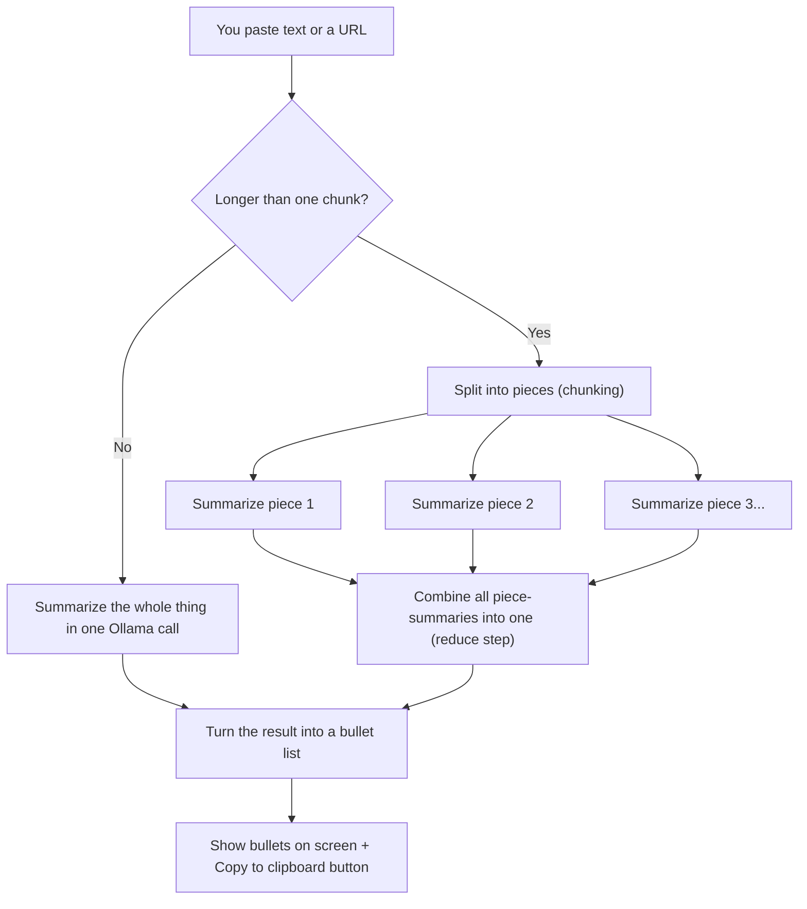

# Day 5: Text summarization feature

**Week 1 — AI Foundations — Text & APIs** · Category: Frontend

## Status

- [x] Built (2026-08-06)

## Run it

```
npm install
cp .env.example .env.local   # check `ollama list` and edit OLLAMA_MODEL if needed
ollama serve                 # if it isn't already running as a background service
npm run dev
```

Open http://localhost:3000. Paste in a long piece of text (or a few short paragraphs), pick Extractive or Abstractive, and click Summarize. Try pasting something really long to see the chunking and "combining" steps kick in.

---

## Explain it like I'm 10

Imagine you're asked to summarize a whole storybook, but you're only allowed to read one page at a time, and you have a bad memory — once you finish a page, you forget the exact words, just remember the gist.

Here's how you'd actually do it:

1. Read page 1, write down its 2-3 main points.
2. Read page 2, write down ITS main points (you don't remember page 1 anymore, so you don't try to connect them yet).
3. Keep going, page by page, until the whole book is done.
4. Now you have a small pile of "main points" notes, one pile per page.
5. Read through ALL your notes together, and write one final, combined list of the book's most important points.

That's exactly what this project does with a long piece of text instead of a book page-by-page. Splitting text into pieces first is called **chunking**. Summarizing each piece separately, then combining those mini-summaries into one final summary, is called **map-reduce** — "map" is the "summarize each piece" step, "reduce" is the "combine them all" step.

There are also two different STYLES of summarizing:

- **Abstractive** — like explaining the story in your own words.
- **Extractive** — like copying out the exact best sentences from the book, word for word, and just leaving the rest out.

This project lets you pick either style, and shows its progress on screen as it works through each step, instead of leaving you staring at a blank screen wondering if it's doing anything.

## How it flows (diagram)



---

## Backend flow: how one request actually travels

This project's backend makes SEVERAL Ollama calls in a row for one summary, not just one — so instead of streaming individual words like Day 1-3, it streams its own small list of "here's what stage I'm on now" updates. Worth tracing carefully.

**Why not just stream tokens like earlier days?** Because there isn't one single AI reply to stream here — there might be 4 or 5 separate AI replies (one per chunk, plus one to combine them), running one after another. Streaming "stage" updates between those calls is a completely different, and honestly simpler, kind of streaming than token-by-token — it's the same `ReadableStream` idea from Day 1, just carrying our own progress messages instead of relaying an AI model's words.

1. **You click Summarize.** `page.tsx`'s `summarize()` sends `fetch('/api/summarize', { method: 'POST', body: { text or url, mode } })`.
2. **Next.js routes it to `app/api/summarize/route.ts`'s `POST` function** — same file-path-is-the-URL idea as every earlier day.
3. **If a URL was given instead of text, the route fetches it first.** `fetchAndExtractText(url)` sends its own separate HTTP request to that URL, gets back raw HTML, and strips out the tags to leave (roughly) plain text. This step doesn't touch Ollama at all yet.
4. **The route decides whether chunking is needed.** `chunkText(sourceText, 350)` (from `lib/chunk.ts`) splits the text into pieces of about 350 words each, always on paragraph or sentence boundaries — never in the middle of a sentence. If the text is short, this returns just one "chunk": the whole thing.
5. **An event gets sent back to the browser immediately**, before any AI call happens: `emit({ stage: 'chunking', totalChunks: N })`. `emit()` just writes one line of JSON into the response stream — the same `ReadableStream` pattern as Day 1, but carrying our own event object instead of AI-generated text.
6. **The "map" step runs — one Ollama call per chunk, one at a time.** For each chunk, `buildMapPrompt(mode, chunk)` builds the instruction text (different wording depending on Extractive vs Abstractive), then `callOllama(prompt)` sends it to Ollama's `/api/generate` and `await`s the complete reply — no streaming inside this individual call, since we're already streaming progress at a higher level. After each chunk finishes, another event goes out: `emit({ stage: 'chunk-summarized', index, totalChunks })`.
7. **The "reduce" step runs next — but only if there was more than one chunk.** `buildReducePrompt(mode, chunkSummaries)` combines all the mini-summaries into one prompt, and one more `callOllama()` call turns that into a single final summary. If there was only one chunk to begin with, this whole step is skipped — that chunk's own summary already IS the final one.
8. **The final text gets cleaned up into a real list.** `parseBullets(finalText)` strips off `"- "` markers, numbers, and blank lines, turning the model's raw reply into a clean JavaScript array of strings.
9. **One last event carries the real result:** `emit({ stage: 'done', bullets })`, then the stream closes.
10. **Back in the browser**, the same read-loop pattern from Day 1 and Day 3 reads each line of this stream, `JSON.parse`s it, and `handleEvent()` reacts to whichever `stage` it is — updating the progress log for stage updates, or filling in the bullet list for `'done'`.

### Why send progress events instead of just waiting and showing a spinner?

A spinner tells you "something is happening," but not what, or how much is left. For a feature that might make 5 separate AI calls in a row, that can feel like it's stuck even when it's working perfectly. Streaming small stage updates costs almost nothing extra to build (it reuses the exact same `ReadableStream` mechanism from Day 1), and turns "please wait" into something the user can actually watch happen.

---

## If someone wakes you up at midnight and quizzes you

**Q: What is chunking, in one line?**
A: Splitting a long piece of text into smaller pieces, each small enough to safely fit inside a model's context window along with the prompt instructions and its reply.

**Q: What is a context window?**
A: The maximum amount of text (measured in tokens, roughly pieces of words) a model can "see" at once — the prompt, any earlier conversation, and the reply all have to fit inside this one limit together. Ollama's default context window is quite small (2048 tokens) unless you explicitly raise it, which is one more reason chunking matters even for local models.

**Q: What is map-reduce summarization?**
A: "Map" = summarize each chunk separately, with no knowledge of the other chunks. "Reduce" = combine all those separate summaries into one final summary. It's called this because it's the same two-step shape as the well-known "map-reduce" pattern from data processing: transform each piece individually, then combine the results.

**Q: What's the actual difference between extractive and abstractive summarization?**
A: Extractive summarization copies the model's picked-out sentences word for word from the original text — nothing new is written. Abstractive summarization has the model rewrite the ideas in its own words, more like how a person would explain something after reading it.

**Q: Why does the reduce step never see the original text, only the chunk summaries?**
A: So its input stays small no matter how long the original document was. If it had to re-read the whole original text plus all the summaries, you'd be right back to the "text is too long for one context window" problem you were trying to solve with chunking in the first place.

**Q: Why does chunking split on paragraph or sentence boundaries instead of just cutting text every N words?**
A: Cutting mid-sentence would hand the model half a thought with no way to know what the other half said, which tends to make the summary of that chunk confused or just wrong. Splitting on natural boundaries keeps every chunk a complete, sensible piece of text on its own.

**Q: Why does the URL-fetching feature come with a big caveat about "not production quality"?**
A: Because it just strips HTML tags with basic pattern matching. Real web pages are full of navigation menus, ads, related-article links, and footers — a proper "readability" extraction library is trained to tell the actual article body apart from all of that noise. This project's simple version can't make that distinction, so results from real websites will include some junk text mixed in.

**Q: Why does this project stream progress events instead of streaming the actual summary text?**
A: Because there isn't one continuous AI reply to stream — there are several separate ones, running one after another, sometimes with real gaps between them (fetching a URL, waiting for each chunk). Progress events fill that gap usefully; streaming tokens wouldn't make sense across multiple separate AI calls the way it did for one single reply in Day 1-3.

---

## What to build

Build a summarize-this-page feature. Accept a URL or pasted text, call the local LLM, show a bullet-point summary. Add copy-to-clipboard.

## Deep-dive topics

- Chunking long text so it fits inside a local model's context window
- Extractive vs abstractive summarization and which prompt style produces which
- Map-reduce summarization for text longer than one context window

## Stack for this project

Next.js, Tailwind, Ollama

## Deep dive: how it actually works (technical)

**File layout**

- `lib/chunk.ts` — `chunkText()`, the paragraph/sentence-aware splitter described above.
- `lib/prompts.ts` — `buildMapPrompt()` and `buildReducePrompt()`, each with genuinely different wording for extractive vs abstractive mode, not just a label swap.
- `lib/ollama.ts` — `callOllama()`, a single non-streaming call to `/api/generate` (`stream: false`), used for every chunk and the final reduce step.
- `lib/extractText.ts` — `fetchAndExtractText()` for the URL path, plus a small `stripHtml()` helper.
- `lib/parseBullets.ts` — cleans up the model's raw reply into a plain string array.
- `app/api/summarize/route.ts` — orchestrates all of the above and streams progress events.
- `app/page.tsx` — the UI: input mode toggle, extractive/abstractive toggle, progress log, final bullet list, copy button.

**What tripped me up / worth knowing:**

- `stream: false` on the Ollama calls here is a deliberate choice, not an oversight — juggling several concurrent token streams (one per chunk) at once would add a lot of complexity for a first attempt at a multi-step pipeline. Waiting for each chunk's complete reply keeps the pipeline logic easy to follow, in exchange for a slightly less "live" feel during each individual chunk's summarization.
- The model doesn't always perfectly follow the "start each line with '- '" instruction. `parseBullets()` exists specifically to clean up whatever actually comes back, rather than trusting the format blindly.
- `navigator.clipboard.writeText()` (used for the copy button) requires a secure context — this works fine on `localhost`, but would need HTTPS on a real deployed site.

---

## Using other AI models (just hints — not built here)

**A different local Ollama model** — no code change needed, just `OLLAMA_MODEL` in `.env.local`. Bigger local models can typically handle a larger chunk size before quality drops, since they tend to have a larger usable context window.

**OpenAI, Claude, Gemini, Groq, Mistral** — the map-reduce pattern itself doesn't change at all when switching providers; only `lib/ollama.ts`'s `callOllama()` would need to change (different endpoint, auth header, and non-streaming response shape — see Day 1 and Day 2's hints for the specifics per provider). Every hosted provider has a MUCH larger context window than a typical local model, which is worth knowing: with GPT-4o or Claude, you might not need chunking at all for anything short of a full book, whereas local models need it for anything much longer than a few paragraphs.

**A dedicated "readability" extraction library** — for the URL path specifically, swapping the simple `stripHtml()` here for a real article-extraction library (the kind browsers use for "reader mode") would be the single biggest quality upgrade for real websites, independent of which AI model is doing the summarizing.
