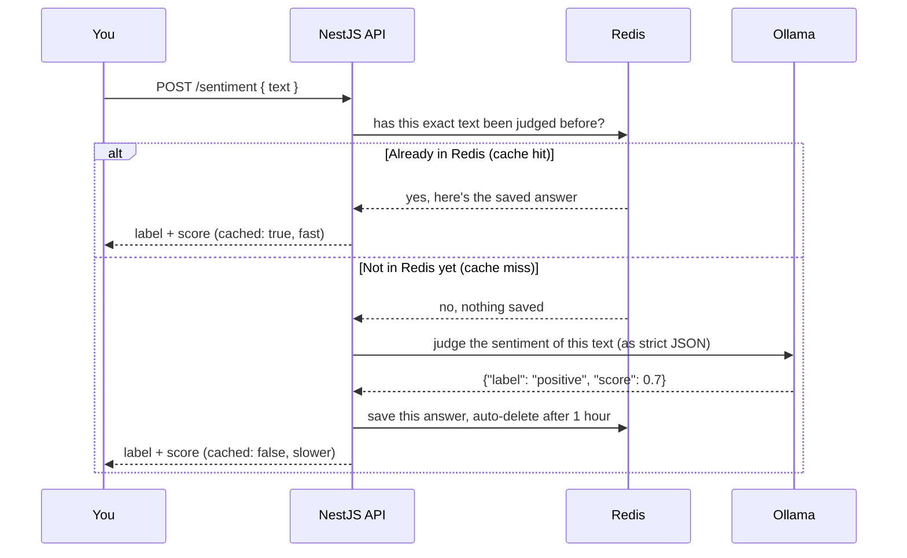

# Day 6: Sentiment analysis API

**Week 1 — AI Foundations — Text & APIs** · Category: Backend

## Status

- [x] Built (2026-08-06)

## Run it

```
docker compose up -d          # starts Redis
cp .env.example .env
npm install
ollama pull llama3.2          # only needed once (or whatever model you have)
ollama serve                  # if it isn't already running as a background service
npm run start:dev
```

Open http://localhost:3002, type a sentence, click Analyze — then click Analyze again on the EXACT same text. Watch `"cached"` flip from `false` to `true`, and the response time drop a lot.

---

## Explain it like I'm 10

Imagine your friend is really smart but really slow — every time you ask them a question, they think hard for 5 whole seconds before answering, even if you asked the EXACT same question yesterday.

Now imagine you get a notebook, and every time your friend answers something, you write down the question and the answer. Next time someone asks the same question, you check the notebook first. If it's already written down, you just read it out — instantly, no waiting for your slow friend at all.

That notebook is what **Redis** is doing in this project. The "slow friend" is the AI model. Every time this API is asked to judge whether some text sounds positive, negative, or neutral, it first checks its notebook (Redis) to see if it already judged this exact text before. If yes — instant answer, no AI call at all. If no — it asks the AI model, THEN writes the answer in the notebook before replying, so it's ready instantly next time.

There's one more twist: the notebook doesn't keep pages forever. Each answer written in gets a little sticky note saying "throw this page away after 1 hour." That way, old answers don't stick around forever and get out of date if you ever change how the AI is asked to judge things.

## How it flows (diagram)



---

## Backend flow: how one request actually travels

### Why Redis, and how it connects

This is the first project in the roadmap using Redis, so worth being clear about it before tracing requests through it.

**Why Redis at all?** Calling the AI model takes real time — reading the text, "thinking," and generating a reply all take noticeably longer than a normal database lookup. If the exact same text gets sent for analysis more than once (a user resubmitting, a batch job re-processing overlapping data, and so on), redoing that full AI call every single time wastes time for no reason — the answer would be identical. A **cache** is fast, temporary storage built for exactly this: "remember the last answer to this exact question, so we can skip redoing the work next time."

**Why Redis specifically, instead of just Postgres, or a plain JavaScript variable?** Redis stores everything in RAM (memory), not on disk, which makes reads and writes extremely fast compared to a normal disk-based database — ideal for this kind of "check a simple key, maybe write a simple value" pattern. It also runs as its own separate program, so if this app were ever running as multiple copies at once (common in real production setups), every copy shares the exact same cache — something a plain in-memory JavaScript variable could never do, since each running copy of the app would have its own separate variable. Redis also has automatic expiry (the TTL, or "time to live," idea from the ELI10 story above) built directly into it — we never had to write our own "delete old entries" cleanup code.

**How does it actually connect, in order?**

1. `docker compose up -d` starts a real Redis server, listening on `localhost:6379`.
2. `.env`'s `REDIS_URL` (`redis://localhost:6379`) is how our app knows where to find it.
3. `RedisService extends Redis` (from the `ioredis` library) and calls `super(REDIS_URL)` in its constructor. **This is different from Prisma in Day 4** — ioredis starts connecting to the Redis server right away, the moment this object is created, rather than waiting for a separate explicit `$connect()` call. We still hook into `onModuleDestroy()` to close the connection cleanly when the app shuts down.
4. From then on, any call like `this.redis.get(key)` or `this.redis.setex(key, ttl, value)` anywhere in our code travels over that same open connection straight to the Redis server.

### Flow: analyzing text — `POST /sentiment`

1. **The tester page (or any client) sends the request.** `fetch('/sentiment', { method: 'POST', body: { text } })`.
2. **Nest's router matches it to `SentimentController.analyze()`** — same file/decorator-based routing as every earlier NestJS day.
3. **The ValidationPipe checks the body first**, same as Day 4 — `AnalyzeSentimentDto` requires `text` to be a non-empty string, before the controller method ever runs.
4. **The controller hands off immediately to `SentimentService.analyze(text)`** — again, staying thin on purpose.
5. **The service computes a cache key from the text.** `cacheKey()` lowercases and trims the text, then runs it through a SHA-256 hash — turning any length of input text into one fixed-length string. This matters for two reasons: the exact same text always produces the exact same key (so repeats are actually detected), and the key stays a short, predictable size no matter how long the original text was.
6. **The service checks Redis first — this is the "cache-aside" pattern.** `this.redis.get(key)`. This is a real network call to the separate Redis program, but a very fast one.
7. **If Redis already has an answer (a cache hit):** the service parses the saved JSON, adds `cached: true`, and returns immediately. Ollama is never called at all on this path — this is the whole point of caching.
8. **If Redis has nothing yet (a cache miss):** the service builds the structured prompt (`buildPrompt()`), and calls `OllamaService.generateJson()` — a THIRD separate program now involved (NestJS, Redis, and Ollama), each reached over its own connection.
9. **Ollama replies with one JSON blob** (`format: 'json'` was set on the request, forcing valid JSON syntax — see below). `parseSentiment()` then defensively checks and cleans up that reply before trusting it.
10. **Before returning, the service writes the fresh answer into Redis** with `this.redis.setex(key, CACHE_TTL_SECONDS, JSON.stringify(result))` — `setex` means "set, and automatically expire after this many seconds." This is the step that makes the NEXT identical request fast.
11. **The result (with `cached: false`) flows back up** through the service, the controller, and out as the JSON HTTP response.

---

## If someone wakes you up at midnight and quizzes you

**Q: What does Ollama's `format: "json"` option actually guarantee?**
A: That the reply is syntactically valid JSON — it will always parse without throwing a syntax error. It does NOT guarantee the JSON has the exact field names or types you asked for. The model could still return the wrong shape entirely.

**Q: So why does the code still parse the response defensively, even with `format: "json"` on?**
A: Because "valid JSON" and "the JSON shape we asked for" are two different guarantees, and only the first one is actually enforced. `parseSentiment()` checks the label is one of the three allowed values (falling back to guessing from the score if not), makes sure score is really a number, and clamps it into the -1 to 1 range — trusting nothing blindly.

**Q: What is the "cache-aside" pattern?**
A: Check the cache first. On a miss, do the real (slower) work, then write the result into the cache before returning it — so the next identical request hits the cache instead. "Aside" because the application code manages the cache itself, rather than the cache being an automatic, invisible layer.

**Q: Why hash the input text instead of just using the raw text as the Redis key?**
A: Two reasons: hashing guarantees a short, fixed-length key no matter how long the input text is, and it still guarantees the exact same text always produces the exact same key — which is all a cache key actually needs.

**Q: What is a TTL, and why does the cached entry expire instead of staying forever?**
A: "Time to live" — how long a cache entry is allowed to exist before Redis automatically deletes it. This project uses 1 hour. If it lived forever, an old cached answer could stay "correct" in the cache long after you'd changed the prompt, model, or logic that produces it — the TTL guarantees stale answers eventually get cleared out automatically.

**Q: Why is Redis a separate program instead of storing this in Postgres, like Day 4's documents table?**
A: They're built for different jobs. Postgres is built for structured, relational, permanent data with complex queries. Redis is built for very fast, simple key-value lookups with automatic expiry — exactly this project's need. You COULD build this same caching behavior in Postgres by hand (a table with a hashed key column, an `expires_at` timestamp, and a cleanup job) — it would just be slower per lookup and more code to maintain, since Redis already does all of that for free.

**Q: Why does `RedisService`'s connection lifecycle look different from `PrismaService`'s in Day 4?**
A: `ioredis` connects immediately when the client object is created — no separate "connect" call needed. `PrismaClient` waits for an explicit `$connect()` call instead, which is why Day 4's `PrismaService` calls it inside `onModuleInit()`. Both still clean up in `onModuleDestroy()`.

---

## What to build

NestJS endpoint that takes text, calls the local LLM with a structured prompt, returns a sentiment score + label as JSON. Add Redis cache so repeated text doesn't re-call the model.

## Deep-dive topics

- Prompting a local model to return strict, parseable JSON
- Defensive JSON parsing when the model adds extra text around the JSON
- Redis caching strategy: hash the input text as the cache key, set a TTL

## Stack for this project

NestJS, Redis, Ollama

## Deep dive: how it actually works (technical)

**File layout**

- `src/redis/redis.service.ts` — thin wrapper making `ioredis`'s client available through Nest's dependency injection, `@Global()` so it doesn't need importing everywhere.
- `src/ollama/ollama.service.ts` — `generateJson()`, a single non-streaming call to `/api/generate` with `format: 'json'` set.
- `src/sentiment/parseSentiment.ts` — the defensive parser, with a fallback that extracts a `{...}` block from the reply if `JSON.parse` fails outright, and a fallback that derives a label from the score if the label field is missing or invalid.
- `src/sentiment/sentiment.service.ts` — the cache-aside logic: check Redis, call Ollama on a miss, write back to Redis, return.
- `src/sentiment/sentiment.controller.ts` + `dto/analyze-sentiment.dto.ts` — the thin HTTP layer and its input validation.
- `src/app.controller.ts` + `src/home.html.ts` — the small inline HTML tester (same pattern as Day 4), useful for actually seeing the `cached: true`/`false` difference without needing curl.

**What tripped me up / worth knowing:**

- `format: 'json'` is an Ollama-specific option that most people miss — without it, you're relying purely on prompt wording ("respond with JSON only") to get valid syntax, which works most of the time but not always. With it, syntax is guaranteed by the model's generation process itself, not just requested politely.
- The cache key normalizes text (`trim().toLowerCase()`) before hashing, so "Great service!" and "great service!" share a cache entry instead of being treated as two different inputs — a small design choice with a real effect on how often the cache actually gets hit.

**Polished on Day 7 (revision day):** `AnalyzeSentimentDto.text` originally had no upper length limit — nothing stopped someone from pasting a huge amount of text, which would silently exceed Ollama's context window instead of failing clearly. Added `@MaxLength(3000)` with a message pointing at Day 5's chunking approach for anything genuinely long. Since the `ValidationPipe` was already wired up globally in `main.ts`, this was a one-line, low-risk fix — a good example of a small gap that's easy to miss when a feature is first built, but obvious once you look for it.

---

## Using other AI models (just hints — not built here)

**A different local Ollama model** — no code change needed, just `OLLAMA_MODEL` in `.env`.

**OpenAI** — has a `response_format: { type: "json_object" }` option (and a newer, stricter "Structured Outputs" mode with a full JSON Schema) that plays the same role as Ollama's `format: 'json'` here — guarantees syntax, still worth double-checking shape.

**Anthropic Claude** — doesn't have a dedicated JSON mode in quite the same way; the common approach is either tool-use (defining a "tool" whose input schema IS your desired JSON shape, and having the model "call" it) or a prompt technique where you start the model's reply for it with `{` to strongly bias it toward JSON. Either way, defensive parsing afterward is still the safe default.

**Google Gemini** — supports `responseMimeType: "application/json"`, plus an optional `responseSchema` to describe the exact shape you want, similar in spirit to OpenAI's Structured Outputs.

The one thing worth remembering: **every provider's "JSON mode" narrows down to roughly the same guarantee Ollama's does here — valid syntax, not a verified shape.** The defensive parsing pattern in `parseSentiment.ts` is the part that actually protects you, and it doesn't change no matter which provider is behind it.
