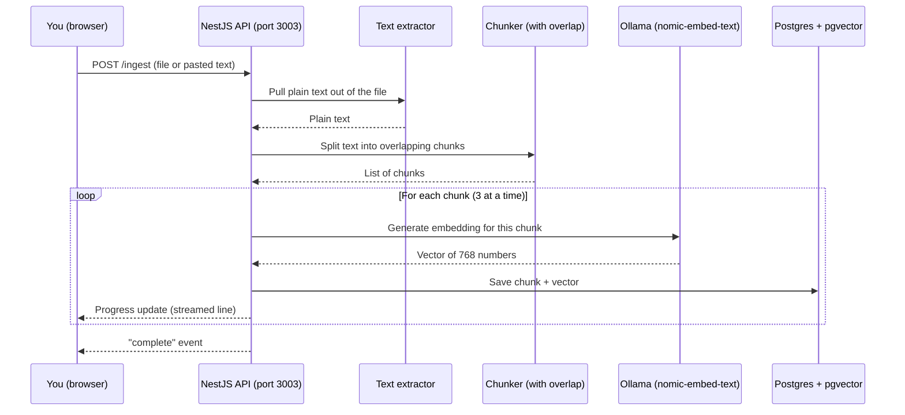

# Day 8: Document ingestion pipeline

**Week 2 — RAG & Knowledge Features** · Category: Backend

## Status

- [x] Built — 2026-08-07

## Run it

```bash
# 1. Start Postgres (with the pgvector extension) in Docker
docker compose up -d

# 2. Copy the env file and fill in values if needed (defaults work as-is)
cp .env.example .env

# 3. Install dependencies
npm install

# 4. Turn on the pgvector extension in the database (one-time step)
npm run db:enable-vector

# 5. Push the Prisma schema to the database (creates the document_chunks table)
npx prisma db push

# 6. Make sure Ollama is running and has the embedding model
ollama serve
ollama pull nomic-embed-text

# 7. Start the app
npm run start:dev
```

Open **http://localhost:3003** — there's a simple upload form (file or pasted text) plus a "list chunks" lookup box.

## Explain it like I'm 10

Imagine you have a huge book, and you want a robot helper to answer questions about it later. The robot can't read the whole book every time you ask something — that's too slow and too much to hold in its head at once.

So instead, you cut the book into small pages (we call these "chunks"), and for each page you make a special fingerprint (we call this an "embedding" — a list of numbers that captures what that page is *about*). You store all these pages and fingerprints in a filing cabinet (the database).

Later, when someone asks a question, the robot can quickly compare the fingerprints and pull out just the right pages — without reading the whole book again. This "cutting into pages and fingerprinting them" step is called **ingestion**, and it's the very first step of building a smart search/question-answering system (this whole idea is called **RAG** — Retrieval-Augmented Generation — and we'll build the "ask questions" half of it in a later day).

One extra trick here: when we cut the pages, we let each page **overlap** a little bit with the next one — like keeping the last sentence of page 3 also at the start of page 4. That way, if an important fact sits right at the page break, it still shows up whole on at least one page.

## How it flows (diagram)



## Backend flow: how one request actually travels

This traces the real code path for `POST /ingest` — a file upload — step by step.

1. **Route + controller**: `src/ingestion/ingestion.controller.ts` has `@Post('ingest')`. A **route** is just "this URL + this HTTP method runs this code." A **controller** is the class that receives the HTTP request and decides what to do with it — in NestJS, controllers should stay "thin" (they don't hold real logic, they just call a service).

2. **File upload handling**: the `@UseInterceptors(FileInterceptor('file', ...))` **decorator** (a decorator is a small `@Something` label that adds behavior to a class or method without you writing that behavior yourself) tells NestJS "expect a file in the form field called `file`, and keep it in memory instead of saving it to disk first." This uses the `multer` library under the hood — the same library most Node file-upload code uses.

3. **Reading the request**: `@Req() req: Request` gives access to the raw request, which is where the `source` name and optional pasted `text` field live (these come from the form fields, not the file). If neither a file nor text was sent, `BadRequestException` is thrown — NestJS turns that into a clean `400` HTTP response automatically.

4. **Streaming response setup**: instead of the normal "return one JSON object at the end" pattern, this endpoint calls `res.writeHead(200, { 'Content-Type': 'application/x-ndjson', ... })` directly on the raw Express response (`@Res() res: Response`). This opens the HTTP response early and keeps it open, so the server can send progress updates as they happen — the same NDJSON (newline-delimited JSON) idea from Day 5's summarizer, but here it travels over NestJS instead of a Next.js Route Handler.

5. **Text extraction**: `extractTextFromFile()` (in `src/ingestion/extractText.ts`) checks the file's mime type. PDFs go through the `pdf-parse` library, which reads the PDF's internal structure and pulls out the text layer. Anything else (`.txt`, `.md`) is just read as raw UTF-8 bytes.

6. **Service call**: the controller calls `this.ingestion.ingest(source, text, emit)` — all the real work lives in `src/ingestion/ingestion.service.ts` (the **service**), keeping the controller thin as mentioned above.

7. **Chunking**: `chunkWithOverlap()` (in `src/lib/chunk.ts`) splits the text into 200-word chunks, each one repeating the last 40 words of the previous chunk. This is different from Day 5's chunker, which split at paragraph/sentence breaks with no overlap — that was right for summarizing (each chunk should be a clean, separate idea), but wrong here, because a fact sitting right on a chunk boundary could get cut in half.

8. **Batch embedding**: `mapWithConcurrency()` (in `src/lib/concurrency.ts`) is a small "worker pool" — it runs at most 3 embedding calls to Ollama at the same time, instead of one-at-a-time (slow) or all-at-once (can overload a local Ollama server running on a laptop). Each finished embedding calls `emit()`, which writes one more line to the still-open HTTP response from step 4.

9. **Saving each chunk**: for each chunk, the service runs a raw SQL `INSERT` via `this.prisma.$executeRaw`. This has to be raw SQL (not a normal Prisma `create()` call) because Prisma doesn't have a native type for pgvector's `vector` column — same reason Day 4's search feature used raw SQL. `toVectorLiteral()` (in `src/pgvector.ts`) turns a JS number array into the text format Postgres expects, like `[0.12,0.98,...]`.

10. **Finishing the stream**: once every chunk is embedded and saved, the service emits a `complete` event, and the controller calls `res.end()` to close the HTTP response. The browser's `fetch` + `ReadableStream` reader (in the inline HTML page) sees the stream end and stops reading.

11. **Looking chunks up later**: `GET /chunks?source=...` is a normal (non-streaming) endpoint. `@Query() query: ListChunksDto` is a **DTO** (Data Transfer Object — a small class that describes the shape of expected input) validated by `class-validator`'s `@IsString()`/`@MinLength(1)` decorators, checked automatically by the global `ValidationPipe`. It runs a `$queryRaw` `SELECT` and returns the matching rows as plain JSON.

## If someone wakes you up at midnight and quizzes you

**Q: What's a "chunk," and why cut the document up at all?**
A: A chunk is a small piece of the document — small enough that an embedding model can turn it into one meaningful fingerprint, and small enough later that a search result gives you a focused answer instead of a whole document.

**Q: Why does this day's chunker overlap, but Day 5's summarizer chunker doesn't?**
A: Summarizing wants clean, separate ideas per chunk, so no overlap. Search/RAG wants no fact to be trapped half-in, half-out of a chunk boundary, so a bit of repeat text (overlap) protects against that.

**Q: What is an embedding, in one sentence?**
A: A list of numbers (a vector) that represents the *meaning* of some text, so that texts with similar meaning end up with similar-looking number lists.

**Q: Why not embed all chunks at once, or one at a time?**
A: One at a time is correct but slow — you wait for each call before starting the next. All at once can overload Ollama running locally. A worker pool (`mapWithConcurrency`, limit 3) is the middle ground.

**Q: Why is the vector column handled with raw SQL instead of normal Prisma code?**
A: Prisma doesn't have a built-in `vector` type. The schema marks it `Unsupported("vector(768)")`, which means "this column exists, but you must read/write it yourself" — using `$queryRaw`/`$executeRaw`.

**Q: Why 768 numbers per vector?**
A: That's how many numbers the `nomic-embed-text` model outputs per embedding. It's fixed by the model, not something we chose.

**Q: What does NDJSON mean, and why use it here instead of Server-Sent Events (Day 3)?**
A: Newline-delimited JSON — one full JSON object per line, sent as the response streams. It's simpler than SSE's `data: ...\n\n` format and doesn't need a special `EventSource` client, which fits a plain `fetch` upload flow better than a browser-native auto-reconnecting event stream.

**Q: What happens if the uploaded PDF has no real text layer (like a scanned image)?**
A: `pdf-parse` would return little or no text, `chunkWithOverlap` would return an empty list, and the service emits an `error` progress event instead of silently saving nothing.

## What to build

Accept PDF/text upload in NestJS. Chunk the text. Generate embeddings via a local Ollama embedding model. Store in PostgreSQL (pgvector). This is step 1 of RAG.

## Deep-dive topics

Research and understand these before or while building — this is the "why" behind the feature, not just the "how":

- Chunking strategies: fixed-size vs sentence/paragraph-aware vs semantic chunking
- Why chunk overlap matters and how much to use
- Extracting text from PDFs (pdf-parse or similar) before chunking
- Batch-generating embeddings efficiently without overwhelming the local Ollama server

## Stack for this project

NestJS, PostgreSQL, Prisma, pgvector, Ollama

## Deep dive: how it actually works (technical)

**`src/lib/chunk.ts` — `chunkWithOverlap(text, chunkWords=200, overlapWords=40)`**
Splits on whitespace into words, then walks forward in steps of `chunkWords - overlapWords`. Each chunk is `chunkWords` words long except possibly the last one. Because the step is smaller than the chunk size, consecutive chunks share `overlapWords` words at the seam.

**`src/lib/concurrency.ts` — `mapWithConcurrency(items, limit, fn)`**
A generic worker-pool helper (works for any array, not just chunks). It spins up `limit` async "workers," each of which loops: grab the next unclaimed index, run `fn` on it, repeat, until the shared index counter runs past the array length. `Promise.all` waits for every worker to finish. This keeps concurrency bounded no matter how many chunks there are.

**`src/ingestion/extractText.ts`**
A thin dispatcher: PDF mime type or `.pdf` extension → `pdf-parse`; everything else → treat the raw buffer as UTF-8 text. No OCR — a scanned PDF with no text layer will extract as empty or near-empty text.

**`src/ingestion/ingestion.service.ts`**
Orchestrates the whole pipeline: chunk → concurrency-limited embed → raw-SQL insert loop, calling an `emit` callback at each stage so the controller can stream progress. Also has `listChunks(source)`, a straightforward `$queryRaw` `SELECT ... WHERE source = ...`.

**`src/ingestion/ingestion.controller.ts`**
Handles the multipart file upload via `FileInterceptor` + `memoryStorage()` (keeps the file in RAM, never touches disk — fine for a learning project, would need size/streaming limits for production-scale files). Opens the HTTP response manually with `res.writeHead` to stream NDJSON progress lines, then calls `res.end()` once ingestion finishes or errors.

**`src/pgvector.ts` — `toVectorLiteral(embedding)`**
Turns `[0.1, 0.2, ...]` into the Postgres text literal `[0.1,0.2,...]` that gets cast to `::vector` in the raw SQL insert. Same helper as Day 4.

**`prisma/schema.prisma`**
`DocumentChunk` model: `source` (which document/upload this chunk came from), `chunkIndex` (its position within that document), `content` (the chunk text), `embedding Unsupported("vector(768)")?`. Table name mapped to `document_chunks`.

**`scripts/enable-pgvector.ts`**
One-time script that runs `CREATE EXTENSION IF NOT EXISTS vector;` against the database — same script as Day 4, since it's the same underlying tool. See Day 4's README for the full "why Docker, why Prisma, how they connect" explanation, since this project reuses that same setup.

## Using other AI models (just hints — not built here)

This project only needs one thing from the AI model: turn text into a vector of numbers (an embedding). Swapping providers means swapping out `src/ollama/ollama.service.ts`'s `embed()` method:

- **OpenAI**: call `POST https://api.openai.com/v1/embeddings` with `model: "text-embedding-3-small"` (1536 numbers per vector, not 768 — you'd need to change the Prisma schema's `vector(768)` to `vector(1536)` too).
- **Google Gemini**: `text-embedding-004` via the Gemini API — also a different vector size than `nomic-embed-text`.
- **Cohere**: has an embeddings endpoint built specifically for search/RAG use cases (separate "search document" vs "search query" input types, which can improve retrieval quality).
- **Other local runners (LM Studio, vLLM, llama.cpp)**: these can also serve embedding models locally, usually through an OpenAI-compatible `/v1/embeddings` endpoint — swapping to one of these mostly means changing the base URL and request shape, not the overall pipeline.

Whatever model you pick, the vector size (768, 1536, etc.) has to match what you store in the `vector(...)` column — the number of dimensions is fixed per model and can't be mixed.

## Notes / learnings

Built alongside Days 1–7. Reused the raw-SQL-for-`vector`-column pattern and the `PrismaService`/Docker setup from Day 4 (see that day's README for the full "why Docker, why Prisma" explanation). The new pieces this day introduces: overlapping chunking (vs Day 5's non-overlapping chunker), a small worker-pool helper for bounded-concurrency embedding calls, PDF text extraction, and NestJS-native NDJSON streaming via a manually-opened `res` object instead of Next.js's `ReadableStream`.

Two setup gotchas hit while wiring this day up, in case they show up again later:

- **Port 5432 clash**: if you already have a native (non-Docker) Postgres running on your machine, it can "win" the `localhost:5432` connection ahead of Docker's container, so Prisma fails with a confusing "database does not exist" even though the container is healthy. Fix: map the container to a free host port instead (this project uses `5434:5432`, same trick Day 4 used with `5433:5432`) and point `DATABASE_URL` at that port.
- **`pdf-parse` + missing `esModuleInterop`**: `pdf-parse` is a plain CommonJS module (`module.exports = fn`), not an ES module. Without `"esModuleInterop": true` in `tsconfig.json`, `import pdfParse from 'pdf-parse'` compiles into a call on a `.default` property that doesn't exist, and fails at runtime with `pdf_parse_1.default is not a function` — even though `tsc` doesn't complain at compile time. Fixed by adding `esModuleInterop` to this project's `tsconfig.json` (Days 1, 2, 3, 5 already had it; this one was missing it).
