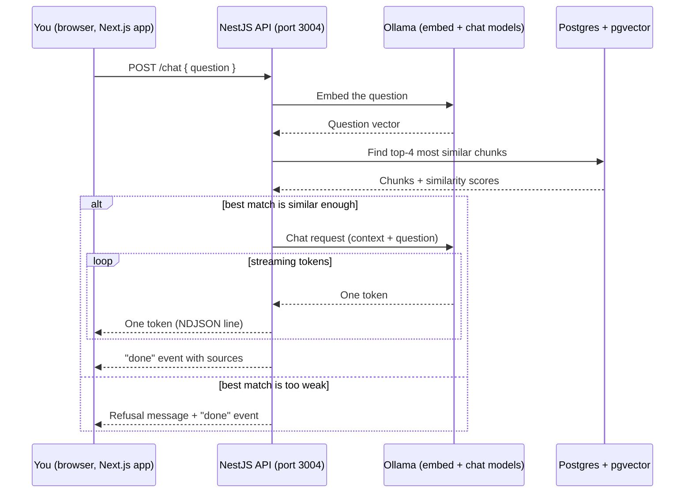

# Day 9: Basic RAG chatbot

**Week 2 — RAG & Knowledge Features** · Category: Full Stack

## Status

- [x] Built — 2026-08-08

## Run it

This day has two apps: a NestJS backend (the RAG logic) and a Next.js frontend (the chat UI). Start the backend first.

```bash
# --- Backend ---
cd backend

# 1. Start Postgres (with pgvector) — the docker-compose.yml is one level up
cd .. && docker compose up -d && cd backend

# 2. Copy the env file (defaults work as-is)
cp .env.example .env

# 3. Install dependencies
npm install

# 4. Turn on the pgvector extension (one-time step)
npm run db:enable-vector

# 5. Push the Prisma schema to the database
npx prisma db push

# 6. Make sure Ollama is running and has both models this project needs
ollama serve
ollama pull nomic-embed-text
ollama pull llama3.2

# 7. Start the backend
npm run start:dev
```

```bash
# --- Frontend (in a second terminal) ---
cd frontend
cp .env.example .env.local
npm install
npm run dev
```

Open **http://localhost:3000**, click "Seed sample documents" once, then ask a question like "What is pgvector?" or "What does RAG stand for?". Ask something unrelated (like "What's the capital of France?") to see the refusal behavior.

## Explain it like I'm 10

Think of a librarian robot. You give it a small stack of books (we "seed" some sample documents). The robot doesn't memorize the books — instead, it cuts each book into short pages and keeps a fingerprint of what each page is about, filed away in a cabinet (this part is exactly what Day 8 built).

Now when you ask a question, the robot does four things, in order:
1. It makes a fingerprint of *your question* too.
2. It compares your question's fingerprint to every page's fingerprint, and pulls out the 4 pages that look most similar.
3. It hands those 4 pages to a second, smarter part of itself (the language model) and says: "Here are some pages. Answer the question using ONLY what's written on them."
4. If none of the pages look similar enough to the question, the robot doesn't guess — it says "I don't have enough information for that."

That whole four-step dance is called **RAG** — Retrieval-Augmented Generation. "Retrieval" is step 2 (finding the right pages). "Augmented Generation" is step 3 (the model's answer is *augmented*, or boosted, with those pages before it generates a reply).

## How it flows (diagram)



## Backend flow: how one request actually travels

This traces `POST /chat` — the moment a user asks a question — step by step.

1. **Frontend sends the request**: `frontend/lib/api.ts`'s `streamChat()` does a `fetch()` to `POST http://localhost:3004/chat` with `{ question }` as JSON. This runs in the *browser*, not on a server — the Next.js app here is a pure client, unlike Day 1–3 where Next.js Route Handlers did the API work themselves.

2. **CORS**: because the frontend (port 3000) and backend (port 3004) are different origins, the browser blocks the request unless the backend explicitly allows it. `backend/src/main.ts` calls `app.enableCors({ origin: ... })` — without this line, the browser's fetch would fail with a CORS error even though the backend is running fine.

3. **Route + controller**: `backend/src/rag/rag.controller.ts` has `@Post('chat')`. As in earlier days, the **controller** stays thin — it opens the streaming response and calls the service, but the real logic lives in `rag.service.ts`.

4. **Validation**: `ChatDto` (in `src/rag/dto/chat.dto.ts`) uses `class-validator` decorators (`@IsString()`, `@MinLength(1)`, `@MaxLength(1000)`) checked by the global `ValidationPipe`. A **DTO** describes the shape input must have; if the question is empty or absurdly long, NestJS rejects the request with a `400` before any of your code even runs.

5. **Streaming response opens**: same technique as Day 8's `/ingest` — `res.writeHead(200, { 'Content-Type': 'application/x-ndjson', ... })` opens the HTTP response early so tokens can be sent one at a time instead of all at once at the end.

6. **Embedding the question**: `rag.service.ts`'s `retrieve()` calls `ollama.embed(question)`, which is `POST /api/embeddings` to Ollama — turning the question into the same kind of 768-number vector that Day 8 created for each document chunk.

7. **Finding similar chunks**: a raw SQL query (`this.prisma.$queryRaw`) asks Postgres/pgvector to sort every row in `document_chunks` by `embedding <=> questionVector` (the `<=>` operator is cosine *distance* — smaller means more similar) and keep the top 4. This has to be raw SQL, same reason as Day 4 and Day 8: Prisma has no built-in type for the `vector` column.

8. **Deciding whether to answer**: distance is converted to similarity (`1 - distance`). If the *best* chunk's similarity is below `MIN_SIMILARITY` (0.3), the service treats this as "the documents don't cover this" and skips calling the chat model entirely — it streams back a fixed refusal message instead. This is the "refuse when context doesn't cover the question" behavior from this day's deep-dive topics.

9. **Building the prompt**: `buildPrompt()` joins the retrieved chunks into one context block and puts a system message in front of the user's question: "answer ONLY using this context, and say so clearly if you can't." This full prompt (system + user messages) is what actually gets sent to the model — the model itself has no idea what "RAG" is, it just receives a normal chat request with extra text stuffed into the system message.

10. **Streaming the model's reply**: `ollama.chatStream()` calls Ollama's `POST /api/chat` with `stream: true`, reads the NDJSON stream Ollama sends back (same relay style as Day 1), and calls `onToken()` for each piece of text as it arrives. Each `onToken` call writes one more `{ token }` line to the still-open HTTP response from step 5 — that line travels over the network immediately, so the browser can show it right away instead of waiting for the whole answer.

11. **Finishing up**: once the model is done, the controller writes a final `{ done: true, refused, sources }` line (the source chunks it used, and their similarity scores) and calls `res.end()`. The frontend's stream reader sees the response end and stops.

12. **Rendering in the browser**: `frontend/app/page.tsx` appends each incoming token straight into the last chat bubble's text as it arrives, so the reply appears to "type itself" — the same idea as ChatGPT-style streaming — and shows the source list underneath once the `done` event lands.

## If someone wakes you up at midnight and quizzes you

**Q: What are the 4 steps of the RAG loop, in order?**
A: Embed the question → retrieve the top-k most similar chunks → stuff those chunks into the prompt as context → generate an answer (or refuse, if nothing retrieved is relevant enough).

**Q: Why does the backend embed the QUESTION, not just the documents?**
A: Similarity search compares vectors to vectors. To find document chunks similar to a question, the question has to be turned into the same kind of vector as the chunks — using the same embedding model (`nomic-embed-text`) so the numbers are comparable.

**Q: What does "top-k" mean here, and what value did we use?**
A: k is how many chunks to retrieve — here, `TOP_K = 4`. Retrieve too few and you might miss the answer; retrieve too many and you waste context window space and can confuse the model with irrelevant text.

**Q: How does the app decide to refuse instead of answering?**
A: It checks the similarity score of the single best-matching chunk. If it's below `MIN_SIMILARITY` (0.3 here), nothing retrieved is considered relevant enough, so the backend skips the model call and returns a fixed "I don't have enough information" message.

**Q: Why is `<=>` cosine DISTANCE and not similarity? Why convert it?**
A: pgvector's operator returns distance (0 = identical, bigger = more different) because that's what's efficient to sort by in the database. The code converts to similarity (`1 - distance`) afterward because "must be above a similarity threshold" reads more naturally than "must be below a distance threshold."

**Q: Why does this project need CORS, but Day 8 didn't?**
A: Day 8's inline HTML tester was served BY the same NestJS app, so browser and API shared one origin (`localhost:3003`). Here the chat UI is a separate Next.js app on port 3000 calling an API on port 3004 — different origin, so the browser requires the API to explicitly allow it via CORS.

**Q: Where does the actual document storage/chunking logic come from?**
A: The same pattern as Day 8 (`document_chunks` table, `vector(768)` column, raw SQL insert/select) — this project's `documents` module is a smaller, non-streaming version of Day 8's ingestion, used here just to seed a few short sample documents.

## What to build

Retrieve top-k relevant chunks from pgvector. Feed them as context to the local LLM. Build a Q&A chat UI. The LLM answers only from your documents.

## Deep-dive topics

Research and understand these before or while building — this is the "why" behind the feature, not just the "how":

- The full RAG loop: embed query → retrieve top-k → stuff into prompt → generate
- Context window budgeting — how many chunks you can afford to include
- Prompting the model to refuse answering when retrieved context doesn't cover the question

## Stack for this project

Next.js, NestJS, pgvector, Ollama

## Deep dive: how it actually works (technical)

**`backend/src/rag/rag.service.ts`**
`retrieve(question)` embeds the question and runs the pgvector cosine-distance query, returning up to `TOP_K` chunks sorted by similarity. `buildPrompt(question, chunks)` formats retrieved chunks with source labels and wraps them in a system message that constrains the model to the given context. `answer(question, onToken)` ties it together: checks the best similarity score against `MIN_SIMILARITY`, and either streams a refusal or streams the model's real answer via `ollama.chatStream`.

**`backend/src/ollama/ollama.service.ts`**
Has two methods this day: `embed()` (same as Day 8, `POST /api/embeddings`) and the new `chatStream()`, which calls `POST /api/chat` with `stream: true` and reads the response body as NDJSON, calling `onToken` per chunk of generated text — this is the same raw-fetch-and-read-loop pattern used for Ollama calls throughout the roadmap, just wrapped as a reusable service method instead of being inlined in a route handler.

**`backend/src/documents/`**
A slimmed-down version of Day 8's ingestion: `sample-documents.ts` has 4 short hardcoded texts about Ollama, pgvector, RAG, and chunking. `documents.service.ts`'s `addDocument()` chunks (via `chunkWithOverlap`, smaller defaults than Day 8 since these documents are short), embeds each chunk, and inserts it with the same raw-SQL pattern as Day 8. `POST /documents/seed` runs this for all 4 sample docs; `POST /documents` lets you add your own text.

**`backend/src/rag/rag.controller.ts`**
Opens the NDJSON stream manually (same pattern as Day 8's `IngestionController`), then calls `RagService.answer()`, forwarding each token as its own JSON line, and writing a final line with `done`, `refused`, and the `sources` array once finished.

**`frontend/lib/api.ts`**
`streamChat()` is the frontend's mirror of the backend's streaming controller: reads the `fetch` response body with a `ReadableStream` reader (same technique as Day 3's raw streaming panel), parses each NDJSON line, and calls one of three callbacks (`onToken`, `onDone`, `onError`) depending on what the line contains.

**`frontend/app/page.tsx`**
A single chat page. Keeps `messages` in React state; every `onToken` call appends text onto the *last* message in the array (creating the "typing" effect), and `onDone` attaches the source list to that same message once the answer is complete.

## Using other AI models (just hints — not built here)

This project needs two different AI capabilities — embeddings and chat — and each can be swapped independently:

- **Embeddings**: swap `ollama.embed()`'s target to OpenAI's `text-embedding-3-small`, Google's `text-embedding-004`, or Cohere's embed endpoint. Remember: whatever model you pick, its output vector size must match the `vector(768)` column — a different-size model means updating the Prisma schema too (see Day 8's README for the same note).
- **Chat/generation**: swap `ollama.chatStream()`'s target to OpenAI's `POST /v1/chat/completions` (with `stream: true`), Anthropic's Claude Messages API, Google's Gemini API, or Groq/Mistral's chat endpoints. The prompt-building logic (`buildPrompt`) doesn't need to change — it's just a list of `{ role, content }` messages, which is the same shape nearly every provider's chat API expects.
- **Other local runners (LM Studio, vLLM, llama.cpp)**: these usually expose an OpenAI-compatible `/v1/chat/completions` and `/v1/embeddings` endpoint, so switching to one of these is mostly a base-URL and payload-shape change, not a rewrite of the RAG logic itself.
- Mixing providers is fine too — for example, embeddings from Ollama (cheap, local) with generation from a hosted API (better answer quality) — as long as you're consistent about which embedding model created the *stored* chunk vectors, since query and document vectors must come from the same embedding model to be comparable.

## Notes / learnings

Built alongside Days 1–8. Reused Day 8's `document_chunks` schema and raw-SQL pgvector pattern, and Day 4's cosine-distance-to-similarity conversion. New this day: a genuinely separate Next.js frontend talking to a NestJS backend over CORS (earlier "Full Stack" days like Day 4 and Day 8 served an inline HTML page from the same NestJS app instead), a chat-specific Ollama streaming method (`chatStream`), and a similarity-threshold refusal so the chatbot says "I don't know" instead of making things up when nothing relevant was retrieved.
